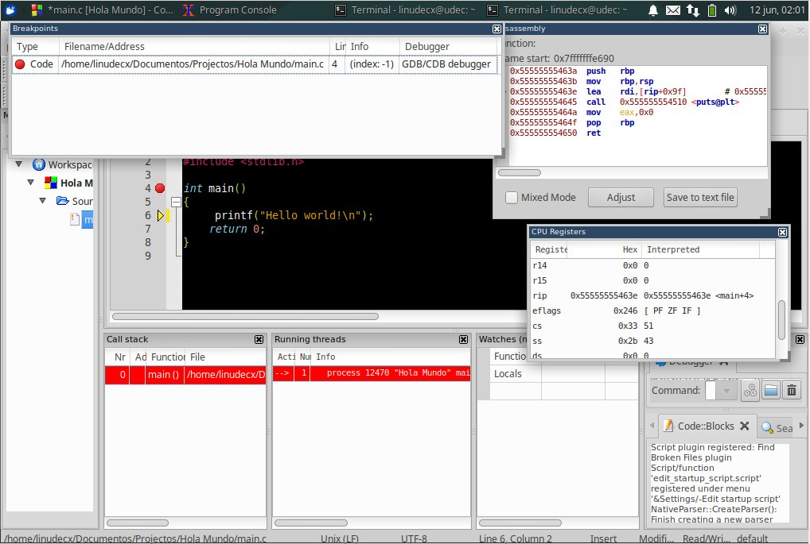

# Configuracion de ambiente de desarrollo

<p align="justify">
Antes de empezar con todo el estudio del lenguaje C, debemos realizar la configuracion de nuestro ambiente de trabajo, abordaremos tres formas de poder trabajar con el lenguaje C. Se empezara documentando cada una de las tres formas de poder compilar y trabajar el lenguaje C (aunque existen mas). Dentro de las tres formas que se explicaran aqui, se dara pie para que los recien llegados a Gnu/Linux no les quede tan dificil la transicion a este sistema operativo, dando la oportunidad de que la persona que lea este material sea capaz de escoger alguna de las tres (de acuerdo a su experiencia o si quiere experimentar, que pueda hacerlo).
</p>

<p align="jusfity">
Esta claro que el uso de un IDE (Entorno Integrado de desarrollo) facilita la vida del desarrollador realizando muchas cosas por el (configuraciones, etc, etc), pero lo ideal es que el desarrollador primero conozca bien su forma de trabajar(compilando, generando codigo obj, incluyendo librerias, compilar sus propias librerias, debuggeando, etc) y luego si pase a un IDE. Ya que con esto no crearia dependencia aun solo IDE, si no que seria capaz de migrar algun IDE en algun momento y que la curva del aprendizaje sea mucho mas rapida. 
</p>

<p align="justify">
En esta primera fase no se abordara el uso de los archivos make, solo se enfocara en la programacion del lenguaje C, En llegado caso de ser necesitado se hablara de ello y se daran algunos ejemplos basicos, en la segunda fase se profundizara mucho sobre esto( http://calcifer.org/documentos/make/ ) ya que los IDE de C por debajo tienen este mecanismo que ayuda mucho en el desarrollo de proyectos grandes
</p>

## Instalacion de compilador y herramientas necesarias(Linux)

Para instalar GCC (que sera nuestro compilador de trabajo) debemos realizar ejecutar el siguente comando:

```bash
sudo apt-get install build-essential
```
<p align="center">

</p>

<p align="justify">
Estamos instalando por medio de los repositorios de ubuntu todo el paquete necesario para poder compilar con el gcc(compilador para lenguaje C) y el g++(compilador para c++) este paquete se llama build-essential. Aparte de esto nos incluye otros paquetes necesarios o que le dan una funcionabilidad mas (por ejemplo el dpkg-dev es usado para crear paquetes de nuestros programas para la instalacion).
</p>

<p align="justify">
Ahora vamos a comprobar la instalacion del compilador gcc que vamos a usar para poder compilar nuestros programas en C y verificar la version. 
</p>

```
gcc --version 
```

<p align="center">

</p>

<p align="justify">
Con esto ya tenemos nuestro compilador basico para poder empezar a trabajar, idenpendiente de que forma se escoja.
</p>

## Configuracion de IDE o de formas alternativas de trabajo

### CodeBlocks

<p align="center">

</p>

<p align="justify">
Codeblocks es un IDE libre, que esta liberado bajo la licencia(GPL v3). Creado por la gran demanda de usuarios. Es un IDE multiplataforma (puede ejecutarse en Linux, Mac, Windows), esta escrito en C++ sin lenguajes interpretados ni con librerias propietarias. Soporta una gran variedad de compiladores, es rapido y personalizable, brinda soporte para usar diferentes nucleos, permite realizar cross compiling(para circuitos integrados avr, arm y otro. Brinda una gran indepencia de proyectos(aislamiento).
</p>

<p align="justify">
Permite realizar Debugging por medio de una interface a GDB (GDB es un programa que permite depurar nuestros programas para encontrar erores o para comprender como se comporta el binario). 
</p>

#### Instalacion 

```bash
sudo apt-get install codeblocks
```
<p align="center">


<p align="justify">
Despues de ejecutar el comando de instalacion (asi tal cual como lo hicimos con el compilador gcc) codeblocks instalara las dependencias que necesitara para ejecutarse y quedara instalado dentro de nuestro equi, en xubuntu lo podran buscar en el menu y en el submenu "Desarrollo" o "Programacion" con el icono de una palita, o tambien podrian llamarlo desde una terminal de comandos solo escribiendo codeblocks.
</p>

#### Primera vista y algunas configuraciones

<p align="center">

</p>

<p align="justify">
Al ejecutar nuestro ide, nos mostrar una lista de los compiladores que ha detectado sobre nuestra maquina, como podemos ver el listado de compiladores que soporta codeblocks es bastante amplio, pero como solo nosotros usaremos gcc por ahora, ese sera el que seleccionaremos y lo setearemos por default.
</p>

<p align="center">

</p>

<p align="justify">
Nos encontraremos con esta primera vista. Desde aqui podriamos antes de sentarnos a tirar miles y miles lineas  de codigo debemos realizar una preconfiguraciones para trabajar un poco mas comodos.
</p>

<p align="center">

</p>

<p align="justify">
Primeramente entraremos a las configuraciones del compilador para verificar que todo este bien, en este primera imagen se puede apreciar que el compilador gcc tiene diferentes opciones de compilacion(igual esto se ira viendo sobre la marcha y se profundizara en la segunda fase de la mano con make) por ejemplo si queremos compilar para que el binario se ejecute en maquinas con arquitectura de 32 bits o de 64 bits, normalmente se targetea  a maquinas de 32 ya que en algunos casos cuando se ejecuta un binario para una maquina de 32 bits en una maquina de 64 bits puede que exista la compatibilidad y se ejecute.
</p>

<p align="center">

</p>

<p align="justify">
En la ventana "Toolchain executables" podremos ver que ejecutables estan cargados para realizar la tarea de compilacion, si vemos bien el mensaje en rojo vemos que nos esta definiendo que la mayoria de programas deben existir en la ruta /usr/bin/[aqui-los-programas]. Y ejecutamos desde la consola "ls -a /usr/bin" podemos encontrar todos los binarios alli, hasta los binarios del sistema.  
</p>

<p align="center">

</p>


<p align="justify">
Otra configuracion que debemos hacer es la funcion de "auto guardado", para que nuestro IDE vaya auto guardando las modificaciones que vamos haciendo sobre el codigo, para no perder nuestro trabajo(experiencia personal). Para llegar a esta opcion debemos ir a "Configuraciones de Entorno". Vamos a poner el auto guardado en todos los archivos cada un minuto y en todos los proyecto cada 1 minuto y que guarde en el archivo original.
</p>


<p align="center">

</p>

<p align="justify">
En este mismo menu en la parte de "Syntax highlighting" podremos cambiar de color nuestro editor de texto, colocandole un color a cada estamento del lenguaje C. Cada theme tiene una configuracion diferentes y pues definida por el programador. Si deseamos agregar diferentes themes para nuestro editor de texto del IDE, debemos descarganos el archivo ubicado:
</p>

[themes.conf](files/themes.conf)

<p align="center">

</p>

<p align="justify">
Este archivo lo encontramos dentro del wiki de codeblocks, este archivo tiene una variedad de themes predifinidos por otros usuario que usan codeblocks, entonces solo tenemos que exportar esta configuracion a nuestro IDE. para hacer eso debemos ejecutar el comando de mover un archivo 
</p>

```bash
mv DondeEstaElarchivo/themes.conf ~/.config/codeblocks.conf
```

<p align="justify">
Despues de mover el archivo a la carpeta de configuraciones del codeblocks debemos reiniciar nuestro codeblock y tendriamos en nuestro IDE cargados todos los themes publicos.
</p>

<p align="center">

</p>

#### Creando un nuevo proyecto

<p align="center">

</p>

<p align="justify">
Para poder entrar a codificar y compilar nuestros codigos fuentes, lo debemos hacer por medio de un nuevo proyecto. Donde cada proyecto podra tener diferentes configuraciones y estaran aislados unos de otros. 
</p>

<p align="center">

</p>

Cuando iniciamos un nuevo proyecto debemos definir que tipo de proyect sera, cada uno de estos tipos de proyectos son especificos para un problema por ejemplo un proyecto "AVR Project" sera usado cuando necesitemos escribir algun codigo en C para AVRs. Por ahora solo seleccionaremos "Console Application".

<p align="center">

</p>

<p align="justify">
Al iniciar un nuevo proyecto debemos definir el nombre del proyecto y el directorio donde estara guardado. El IDE nos generara un archivo .cbp que define las configuraciones del proyecto para poderlo abrir de nuevo con codeblocks.
</p>

<p align="center">

</p>

<p align="justify">
Ahora debemos seleccionar el lenguaje en el cual codificaremos nuestro proyecto, (Normalmente siempre escojeremos C, tal vez en una fase mas avanzada trataremos algo de C++ pero puede que si, puede que no).
</p>

<p align="center">

</p>

<p align="justify">
Ahora seleccionaremos el compilador a usar, las opciones de compiladores nos saldran de acuerdo a la cantidad de compiladores que tengamos instalados en nuestra maquina, como vimos en el principio codeblocks soporta muchos compiladores. Al seleccionar un compilador automaticamente cargar el programa que nos ayudara a depurar nuestros programas y tambien se define las dos carpetas "Debug" donde aqui se hacen las pruebas de desarrollo y "Release" quedara la version liberada de nuestro codigo cuando ya acabemos de codificarlo(eso lo debemos decidir nosotros en el momento de compilacion).
</p>

<p align="center">

</p>

<p align="justify">
Al terminar de crear nuestro nuevo proyecto, nuestra vista sera algo asi, donde tendremos en la parte lateral izquierda nuestro workspace (el workspace es donde estaran todos los proyectos abiertos, puede que estos proyectos tengan relacion entre otros proyectos pero en cierta manera aqui todos los proyectos que abramos estaran ubicados en esta parte de la ventana), En el centro tenemos nuestro editor de texto, en la parte vertical abajo tenemos nuestra ventanas de Logs general tanto de compilacion como del IDE(mucho ojo en esta parte ya que aqui el compilador nos marcara los errores de programacion que sean de sintaxis mas no logicos) y en la parte superior la barra de tareas con nuestra barra de acciones, donde podremos compilar o ejecutar o debuggear nuestro proyecto.
</p>

<p align="center">

</p>

Compile and Run :).

#### Debug

<p align="center">

</p>

<p align="justify">
Cuando queremos hacerle debugging a un programa es por que queremos encontrar errores logicos de programacion, haciendole una repuracion linea por linea y visualizar todas las operaciones que se hacen por debo de la capa de C (en asm), tambien nos permite visualizar como se esta comportando el stack de un programa u otras funcionabilidades especificas.(para entrar en este modo, es con el play de color rojo).
</p>

<p align="center">

</p>

(Este tema se ira tratando de abordar con los ejercicios que se haran haciendo)

### Sublime + Pluggins

### Vim + Some Weird Stuff

## Referencias


