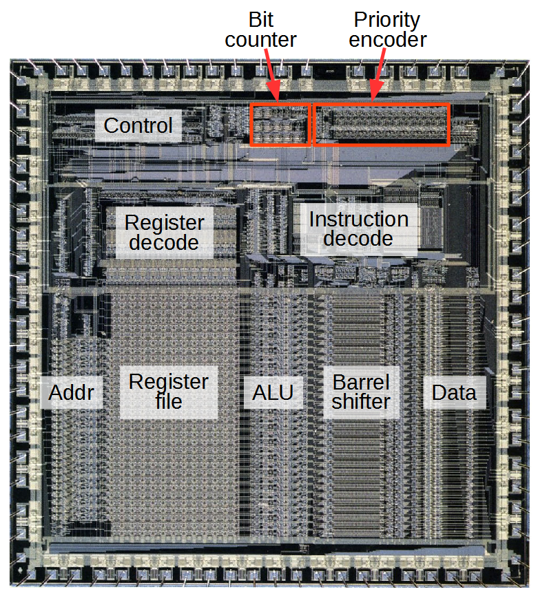

# Introduccion

Antes de iniciar nuestra aventura en el mundo de la programacion con el lenguaje C de la mano con el libro referencia <b>C Primer Plus 6th</b>. Realizaremos una introduccion basada en el contenido del primer capitulo de nuestro libro de referencia (Como recomendacion usar el libro antes nombrado para tener un mayor contenido de aprendizaje). En esta parte traremos los siguentes temas:

1. Breve historia y caracteristicas
2. Entendimiento de la computadora
3. Pasos para escribir un programa en C
4. Mecanica de desarrollo
5. Introduccion a C con un ejemplo sencillo
6. Keywords

## Breve historia y caracteristicas

C es un lenguaje de programación creado en 1972 por Dennis M. Ritchie en los Laboratorios Bell. Es un lenguaje orientado a la implementación de Sistemas Operativos, concretamente Unix. C es apreciado por la eficiencia del código que produce y es el lenguaje de programación más popular para crear software de sistemas, aunque también se utiliza para crear aplicaciones.  Se trata de un lenguaje débilmente tipificado de medio nivel pero con muchas características de bajo nivel. Dispone de las estructuras típicas de los lenguajes de alto nivel pero, a su vez, dispone de construcciones del lenguaje que permiten un control a muy bajo nivel. Los compiladores suelen ofrecer extensiones al lenguaje que posibilitan mezclar código en ensamblador con código C o acceder directamente a memoria o dispositivos periféricos. se pueden desarrollar compiladores de C fácilmente. En consecuencia, el lenguaje C está disponible en un amplio abanico de plataformas (seguramente más que cualquier otro lenguaje). Además, a pesar de su naturaleza de bajo nivel, el lenguaje se desarrolló para incentivar la programación independiente de la máquina. Un programa escrito cumpliendo los estándares e intentando que sea portátil puede compilarse en muchos computadores.
C se desarrolló originalmente (conjuntamente con el sistema operativo Unix, con el que ha estado asociado mucho tiempo) por programadores para programadores. Sin embargo, ha alcanzado una popularidad enorme, y se ha usado en contextos muy alejados de la programación de sistemas, para la que se diseñó originalmente

Tambien cabe decir que el lenguaje C incorpora las caracteristicas necesarias para la teoria y la practica de las ciencias de la computacion (planeamiento <i>top-down, programacion estructurada, diseño modular</i>). C tiene la versatibilidad de permitir escribir codigo para procesadores de 8 bits o para procesadores de supercomputadoras pero hay que tener en cuenta que si se realiza un codigo para un sistema operativo especifico (sea linux o windows o etc) sera un poco complicado que existe compatibilidad entre en las dos plataformas (por que los binarios generados para cada sistema son diferentes, y las funciones que se usan del api cambian).

El lenguaje C brind una gran libertad (no tanto como Ensamblador) al desarrollador en poder hacer ciertas cosas que en otros lenguajes no se podria hacer y esta libertad con lleva una gran resposabilidad, dado que nos permite tener acceso al hardware y al sistema operativo. Los errores que aveces se pueden encontrar programando son algunas veces dificil de encontrar (por ejemplo usando punteros) y con esto vamos a <b>"El precio de la libertad es una eterna vigilancia"</b>.

A veces leer codigo en C es muy dificil y poder seguirle el paso es muy dificil, pero ese es uno de los retos de C por algo anualmente se hacia un contest de codigo ofuscado.

 
https://www.ioccc.org/

<b>C != C++ (y otros intentos de sabores de C)</b>. Cuando programamos en C++ programamos sin tener fundamentos de C puro, caemos algunas veces en la programacion por cajas negras, sabemos usar ciertas funciones predefinas por el lenguaje y sus librerias pero en realidad solo sabemos que entran ciertos parametros y salen ciertos procesamientos, con C tenemos todo el conocimiento del funcionamiento de las cosas al frente de nosotros y nos obliga a estar en constante evolucion. Con esto concluimos que aprendiendo C nuestra curva de aprendizaje de otro lenguaje sera mucho mas rapida y a parte de esto C es y sera uno de lenguajes mas usados y poderosos del mercado. C tiene diferentes aplicaciones y formas de uso, todo depende del enfoque que se le da al lenguaje aprovechando todas las caracteristicas del mismo.

## Entendimiento de la computadora

Para poder programar en C, se debe tener un entendimiento de las funciones de la computadoras un poco. empezando por los componentes que tiene:

1. CPU (Cental Unit Process)

<b>Creacion de un procesador - Intel</b> 
https://www.youtube.com/watch?v=d9SWNLZvA8g

<b>Decapping de varios procesadores</b> 

<b>Simulador de procesador - www.visual6502.org/JSSim</b> 

<b>Vista basica en diagramas de bloques</b> 

<b>Vision general</b> 

2. RAM (Random Access Memory)

<b>Vision fisica de memoria RAM</b> 

<b>Vision interna de memoria RAM</b> 

3. Almacenamiento (Usb, HardDrive, Etc)

<b>Disco Duro</b> 

4. Perifericos (Medios de entrada y salida de datos)

<b>Partes de una MotherBoard</b> 

Haciendo un poco de enfasis en el procesador podemos concluir que es muy simple en realidad, el procesador toma una instruccion desde la memoria, entiende la instruccion y realiza una accion (acciones predefinidas en las instrucciones del procesador) y repite el proceso, pero esto lo hace a una gran velocidad (la unidad de medida sobre las computadoras son la cantidad de veces que puede ejecutar instrucciones en un tiempo dado, <b>Hertz</b>, Los Hertz en los computadores representa la cantidad de instrucciones procesadas en 1 segundo. Cuando nos referimos a un procesador de 2.6 GigaHertz (x10^9) queremos decir que ese procesador ejecuta <b>2.600.000.000</b> instrucciones por segundo).

Los procesadores contienen unos espacios donde se puede almacenar cierto informacion del estado del procesador. Estos espacios son llamados <b>registros</b>, estos espacios solo pueden un numero. Por ejemplo uno de estos registros y que tiene una funcion muy importante es el EIP (Extended Instruction Pointer), este registro guardara la posicion de memoria donde esta ubicado la parte del programa que esta ejecutando el procesador. Existen muchos registros mas y dependiendo de la familia del procesador pueden cambiar un poco. Nosotros podremos hablar directamente con el procesador por medio del lenguaje ensamblador y darle instrucciones muy especificas para que realizan una accion sobre un conjunto de bytes.

La mecanica de programar en Ensablador surgio mucho antes de C y era algo riguroso programar en ensablador muy al estilo de mover valores a registros, realizar comparaciones y saltos de codigo por todo el programa. Programar en ensamblador tiene sus ventajas y su desventajas ya que se debe ser muy especifico con los valores que se esta trabajando y la forma de trabajarlos (muy manual). Pero por otro lado surgio C un lenguaje de alto nivel pero sin perder el poder de manipular los recursos del computador he inclusive mezclar codigo ensamblador con C para ganar velocidad y optimizacion.

## Alto nivel y compiladores

Los Lenguajes de alto nivel estan para facilitarle el desarrollo al programador (pero tampoco esperar que todo el lenguaje haga todo por uno). Brindando abstracciones al programador que son mas faciles de usar y que sean un poco mas entendibles para el humano (Los lenguajes de alto nivel normalmente describen de forma abstrata las acciones que hara el procesador). El lenguaje C es considerado de alto nivel y/o medio nivel (ya que abstrae la mecanica de programar en lenguaje ensamblador a una sintaxis un poco mas humana). Aqui entra juego los compiladores, los compiladores son programas que se encargan de tomar el archivo escrito en lenguaje C traducirlo a lenguaje maquina (1010 1010 1010 1110). Mas o menos el proceso es de esta manera (se profundizara mas adelante).

Cada familia de procesadores maneja un set de instrucciones diferente entonces si realizamos un programa en ensamblador, el programa sera dependiente a la maquina en donde se esta programando. Uno de los objetivos de C al crearse fue poder hacer el lenguaje un poco mas independiente del tipo de procesador donde se estuviera programando. El compilador se encargara de pasarlo a una arquitectura definida (si es posible y si se configura para que asi sea).

> Trabajo extra: Averiguar como funciona JVM , ART , CLR otros RunTime Machines.  

## Pasos para escribir un programa en C

1. Definir los objetivos del programa

2. Diseñar el programa

3. Escribir codigo

4. Compilar

5. Ejecutar el programa

6. Realizar pruebas, Debuggear el programa

7. Mantener y modificar el programa

## Mecanica de desarrollo
## Introduccion a C con un ejemplo sencillo
## Keywords

# Referencias
1. https://www.ecured.cu/Historia_del_Lenguaje_C
2. http://www.righto.com/2016/01/counting-bits-in-hardware-reverse.html
3. http://www.instructables.com/id/How-to-expose-the-die-contents-of-an-old-CPU/
4. https://www.quora.com/What-are-the-best-open-source-CPUs
5. https://wikimedia.org
6. https://blog.dell.com/en-us/laptop-hard-drive-failure-prevention-101/
7. http://www.c-jump.com/CIS60/lecture01_2.htm
8. https://stackoverflow.com/questions/11253303/how-does-the-java-runtime-environment-compare-with-the-net-framework-in-terms-o
