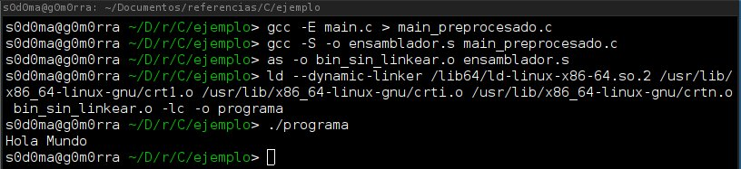

# Introduccion

<p align="justify">
Antes de iniciar nuestra aventura en el mundo de la programacion con el lenguaje C de la mano con el libro referencia <b>C Primer Plus 6th</b>. Realizaremos una introduccion basada en el contenido del primer capitulo de nuestro libro de referencia (Como recomendacion usar el libro antes nombrado para tener un mayor contenido de aprendizaje). En esta parte traremos los siguentes temas:
</p>

1. Breve historia y caracteristicas
2. Entendimiento de la computadora
3. Pasos para escribir un programa en C
4. Mecanica de desarrollo
5. Keywords

## Breve historia y caracteristicas

<p align="justify">
C es un lenguaje de programación creado en 1972 por Dennis M. Ritchie en los Laboratorios Bell. Es un lenguaje orientado a la implementación de Sistemas Operativos, concretamente Unix. C es apreciado por la eficiencia del código que produce y es el lenguaje de programación más popular para crear software de sistemas, aunque también se utiliza para crear aplicaciones.  Se trata de un lenguaje débilmente tipificado de medio nivel pero con muchas características de bajo nivel. Dispone de las estructuras típicas de los lenguajes de alto nivel pero, a su vez, dispone de construcciones del lenguaje que permiten un control a muy bajo nivel. Los compiladores suelen ofrecer extensiones al lenguaje que posibilitan mezclar código en ensamblador con código C o acceder directamente a memoria o dispositivos periféricos. se pueden desarrollar compiladores de C fácilmente. En consecuencia, el lenguaje C está disponible en un amplio abanico de plataformas (seguramente más que cualquier otro lenguaje). A pesar de su naturaleza de bajo nivel, el lenguaje se desarrolló para incentivar la programación independiente de la máquina. Un programa escrito cumpliendo los estándares e intentando que sea portátil puede compilarse en muchos computadores.
C se desarrolló originalmente (conjuntamente con el sistema operativo Unix, con el que ha estado asociado mucho tiempo) por programadores para programadores. Sin embargo, ha alcanzado una popularidad enorme, y se ha usado en contextos muy alejados de la programación de sistemas, para la que se diseñó originalmente
</p>

<p align="justify">
Tambien cabe decir que el lenguaje C incorpora las caracteristicas necesarias para la teoria y la practica de las ciencias de la computacion (planeamiento <i>top-down, programacion estructurada, diseño modular</i>). C tiene la versatibilidad de permitir escribir codigo para procesadores de 8 bits o para procesadores de supercomputadoras pero hay que tener en cuenta que si se realiza un codigo para un sistema operativo especifico (sea linux o windows o etc) sera un poco complicado que exista compatibilidad entre en las dos plataformas (por que los binarios generados para cada sistema son diferentes, y las funciones que se usan del API cambian).
</p>

<p align="justify">
El lenguaje C brinda una gran libertad (no tanto como Ensamblador) al desarrollador de poder hacer ciertas cosas que en otros lenguajes no se podria hacer y esta libertad conlleva una gran resposabilidad, dado que nos permite tener acceso al hardware y al sistema operativo. Los errores que aveces se pueden encontrar programando son algunas veces dificil de encontrar (por ejemplo usando punteros) y con esto vamos a <b>"El precio de la libertad es una eterna vigilancia"</b>.
</p>

<p align="justify">
A veces leer codigo en C es muy dificil y poder seguirle el paso es muy dificil, pero ese es uno de los retos de C por algo anualmente se hacia un contest de codigo ofuscado.
</p>
<p align="center">
<br>
https://www.ioccc.org/
</p>

<p align="justify">
<b>C != C++ (y otros intentos de sabores de C)</b>. Cuando programamos en C++ programamos sin tener fundamentos de C puro, caemos algunas veces en la programacion por cajas negras, sabemos usar ciertas funciones predefinas por el lenguaje y sus librerias pero en realidad solo sabemos que entran ciertos parametros y salen ciertos procesamientos, con C tenemos todo el conocimiento del funcionamiento de las cosas al frente de nosotros y nos obliga a estar en constante evolucion. Con esto concluimos que aprendiendo C nuestra curva de aprendizaje de otro lenguaje sera mucho mas rapida y a parte de esto C es y sera uno de lenguajes mas usados y poderosos del mercado. C tiene diferentes aplicaciones y formas de uso, todo depende del enfoque que se le da al lenguaje aprovechando todas las caracteristicas del mismo.
</p>

<p align="center">

</p>

## Entendimiento de la computadora

<p align="justify">
Para poder programar en C, se debe tener un entendimiento de las funciones de la computadoras. empezando por los componentes que tiene:
</p>

1. CPU (Cental Unit Process)

<p align="center">
<b>Creacion de un procesador - Intel</b><br>
https://www.youtube.com/watch?v=d9SWNLZvA8g
</p>

<p align="center">
<b>Decapping de varios procesadores</b><br>

</p>

<p align="center">
<b>Simulador de procesador - www.visual6502.org/JSSim</b><br>

</p>

<p align="center">
<b>Vista basica en diagramas de bloques</b><br>

</p>

<p align="center">
<b>Vision general</b><br>

</p>

2. RAM (Random Access Memory)

<p align="center">
<b>Vision fisica de memoria RAM</b><br>

</p>

<p align="center">
<b>Vision interna de memoria RAM</b><br>

</p>

3. Almacenamiento (Usb, HardDrive, Etc)
<p align="center">
<b>Disco Duro</b><br>

</p>

4. Perifericos (Medios de entrada y salida de datos)

<p align="center">
<b>Partes de una MotherBoard</b><br>

</p>

<p align="justify">
Haciendo un poco de enfasis en el procesador podemos concluir que es muy simple en realidad, el procesador toma una instruccion desde la memoria, entiende la instruccion y realiza una accion (acciones predefinidas en las instrucciones del procesador) y repite el proceso, pero esto lo hace a una gran velocidad (la unidad de medida sobre las computadoras son la cantidad de veces que puede ejecutar instrucciones en un tiempo dado, <b>Hertz</b>, Los Hertz en los computadores representa la cantidad de instrucciones procesadas en 1 segundo. Cuando nos referimos a un procesador de 2.6 GigaHertz (x10^9) queremos decir que ese procesador ejecuta <b>2.600.000.000</b> instrucciones por segundo).
</p>

<p align="justify">
Los procesadores contienen unos espacios donde se puede almacenar cierto informacion del estado del procesador. Estos espacios son llamados <b>registros</b>, estos espacios solo pueden un numero. Por ejemplo uno de estos registros y que tiene una funcion muy importante es el EIP (Extended Instruction Pointer), este registro guardara la posicion de memoria donde esta ubicado la parte del programa que esta ejecutando el procesador. Existen muchos registros mas y dependiendo de la familia del procesador pueden cambiar un poco. Nosotros podremos hablar directamente con el procesador por medio del lenguaje ensamblador y darle instrucciones muy especificas para que realizan una accion sobre un conjunto de bytes.
</p>

<p align="center">

</p>

<p align="justify">
La mecanica de programar en Ensablador surgio mucho antes de C y era algo riguroso programar en ensablador muy al estilo de mover valores a registros, realizar comparaciones y saltos de codigo por todo el programa. Programar en ensamblador tiene sus ventajas y su desventajas ya que se debe ser muy especifico con los valores que se esta trabajando y la forma de trabajarlos (muy manual). Pero por otro lado surgio C un lenguaje de alto nivel pero sin perder el poder de manipular los recursos del computador he inclusive mezclar codigo ensamblador con C para ganar velocidad y optimizacion.
</p>

## Alto nivel y compiladores

<p align="justify">
Los Lenguajes de alto nivel estan para facilitarle el desarrollo al programador (pero tampoco esperar que todo el lenguaje haga todo por uno). Brindando abstracciones al programador que son mas faciles de usar y que sean un poco mas entendibles para el humano (Los lenguajes de alto nivel normalmente describen de forma abstrata las acciones que hara el procesador). El lenguaje C es considerado de alto nivel y/o medio nivel (ya que abstrae la mecanica de programar en lenguaje ensamblador a una sintaxis un poco mas humana). Aqui entra juego los compiladores, los compiladores son programas que se encargan de tomar el archivo escrito en lenguaje C traducirlo a lenguaje maquina (1010 1010 1010 1110).
</p>

<p align="justify">
Cada familia de procesadores maneja un set de instrucciones diferente entonces si realizamos un programa en ensamblador, el programa sera dependiente a la maquina en donde se esta programando. Uno de los objetivos de C al crearse fue poder hacer el lenguaje un poco mas independiente del tipo de procesador donde se estuviera programando. El compilador se encargara de pasarlo a una arquitectura definida (si es posible y si se configura para que asi sea).
</p>

> Trabajo extra: Averiguar como funciona JVM , ART , CLR otros RunTime Machines y que diferencias se encuentran con la forma de compilacion de C.  

<p align="center">

</p>

<p align="justify">
El lenguaje C ha estado en evolucion y tuvo la necesidad de ser definido un estandar del lenguaje, para poder unificar el trabajo de los vendedores y de las personas que realizaban compiladores para C. Estos estandares definidos por han traido nuevas caracteristicas al lenguaje y una mayor portabilidad. Se debe tener en cuenta estos estanadares a la hora de desarrollador en C, por que puede que exista la posibilidad que al intentar usar una caracteristica nueva de C aparezca un error de uso por el estandar que se esta trabajando:
</p>

<p align="justify">
<b>ANSI C || ISO-C || c90 || c89 : </b> Definido por American National Standards Institute, este instituto fue el primero en establecer este estandar, la institucion mantuvo el espiritu libre de C y contribuyo a reforzarlo en algunos aspectos.
<ld>
<li>Confianza en el programador </li>
<li>Mantener el lenguaje pequeño y simple </li>
<li>Prover un unico modo para hacer una operacion</li>
<li>Hacerlo rapido, inclusive si no se garantiza la portabilidad</li>
<li>No prevenir al programador de que necesita para terminar el programa </li>
</ld><br>

<b>c99 : </b> Se mantuvieron la mayoria de los aspectos definidos por el primer estandar y realizaron algunas mejoras.<br><br>
<ld>
<li>Soporte internacion de desarollo (Unicode)</li>
<li>Funciones para ciencias computacionales </li>
<li>Soporte para procesadores de 64 bits</li>
<li>Posibilidad de altenar la compatibilidad de los estandares anteriores</li>
</ld><br>

<b>c11 : </b> Se agregaron las siguentes mejoras.<br><br>
<ld>
<li>Mas seguridad</li>
<li>Procesadores de direntes arquitecturas</li>
<li>Soporte a tareas de concurrencia</li>
<li>Se elimina la funcion gets</li>
<li>Mas macros numericas</li>
</ld><br>
</p>

Mas informacion http://www.iso-9899.info/wiki/The_Standard

Proximamente estaremos viendo la version C17.

## Pasos para escribir un programa en C

1. Definir los objetivos del programa : En esta parte de debe poner la idea clara sobre la mesa sobre la finalidad del programa. Se debe pensar en que informacion necesita para cumplir el objetivo. Definir los calculos que hara. La forma que presentara los resultados, pero no en terminos computacionales si no en terminos logicos.

2. Diseñar el programa : Se debe definir los aspectos tecnicos del programa. Pensar en como estara organizado. Cual sera la arquitectura de las maquinas donde sera usado. Formas de representacion de la informacion.

3. Escribir codigo : Implementar la idea en el lenguaje, Cambios en las herramientas de uso (por ejemplo si programamos para una arquitectura diferente, tener cuidado que tipo de variables usamos). DOCUMENTAR EL TRABAJO (en el mismo codigo y en otros formatos).

4. Compilar : Realizar la traduccion del codigo a lenguaje maquina por medio del compilador. Si se aprende cuales son las tareas que realiza el compilador es un skill que se ira aumentando de acuerdo como compilemos programas. Verificacion de warnings y errores.

5. Ejecutar el programa : Cargar nuestro programa al sistema y verificar que la ejecucion va en orden, podremos realizar esta ejecucion por medio de nuestro IDE o por la linea de comandos o desde el entorno grafico.

6. Realizar pruebas, Depurar el programa : Esta parte es una de las mas importantes del desarrollo de un programa en C, Depurar o Debugging es el proceso para encontrar errores logicos en nuestros programas. Existen muchas herramientas para esto pero la principal en la mayoria de los casos sobre todo para sistemas Gnu/linux y otros se usa **GDB**. Con GDB podemos ver muy de cerca el comportamiento de nuestro programa sobre la maquina.

<p align="center">

</p>

7. Mantener y modificar el programa : Despues de crear nuestra primera version de un programa, debemos mantener nuestro trabajo y estar en constante evolucion y sin perder nuestro trabajo realizado. Git es un control de version que se puede usar en local o en remoto para mantener organizado las versiones de nuestros proyectos y para el trabajo colectivo. Si en algun momento cometemos un error con git podremos "devolver el tiempo" y volver a una version que sea estable.

<p align="center">

</p>

## Mecanica de desarrollo

<p align="justify">
La mecanica de desarrollo de programas en C podriamos separarlos en dos fases, 1) forma de nuestros codigos fuente y 2) Las fases de compilacion de un programa.
</p>

**1) forma de nuestros codigos fuente**

<p align="justify">
La forma o la estructura de nuestros programas en esta primera parte seran de la siguente manera. Supongamos que estamos haciendo un programa que recibe 2 numeros y que  tiene 4 funciones (suma resta, comprobar que sea par y realizar una division), sabiendo esto concluimos que debemos usar el numero 2 para poder hacer la validacion si el numero  es par o es impar pero no como variable si no como constante. (Aunque no se entiendan algunas cosas solo fijarse en los comentarios).
</p>

```c
/* headers */
#include <stdio.h>

/* definiciones y variables globales */
#define   NUMERO  2

/* Prototipo de funciones */
int suma(int, int);
int resta(int, int);
int division(int, int);
int modulo(int);

/* Funcion principal*/
int main(void)
{
  int numero1, numero2;
  scanf("%d %d", &numero1, &numero2);
  printf("Suma     = %d\n",suma(numero1, numero2));
  printf("Resta    = %d\n",resta(numero1,numero2));
  printf("Division = %d\n",division(numero1,numero2));
  printf("Num1 Par = %d\n",modulo(numero1));
  return 0;
}

/* Funciones */
int suma(int a, int b)
{
    return a+b;
}

int resta(int a, int b)
{
  return a-b;
}

int division(int a, int b)
{
  return a/b;
}
int modulo(int c)
{
  return (c%NUMERO == 0) ? 0 : 1;
}

```

<p align="justify">
Podemos decir que un programa basico en C consta de 4 a 5 partes, la primera parte son los headers, son las librerias que vamos a traer para poder usar ciertas funciones del lenguaje o del sistema operativo, estos headers traen dentro de si definiciones y macros que se usaran para x o y accion. los headers son de la parte de preprocesado del compilador ( el compilador toma el codigo fuente y como minimo realiza 2 pasadas tratando de entender lo que hemos escrito y en la primera pasada es la parte de preprocesado, son directivas que el desarrollador escribe para el compilador definiendo algunas reglas antes de empezar el proceso de traduccion a lenguaje maquina), las definiciones o variables globales vienen despues, en esta seccion podremos realizar nuestras directivas de preprocesado personalizadas y definir variables que podremos usar en cualquier parte del programa (para usar diferentes archivos se debe usar extern pero lo veremos con calma mas adelante en codigos fuente mas grandes).
</p>

<p align="justify">
Despues de esto vienen los prototipos de las funciones de nuestro programa. para poder definir nuestras propias funciones dentro de nuestro programa debemos especificarle al compilador como seran estas funciones entonces es como una descripcion pequeña de nuestra funcion en terminos de sintaxis al compilador, por ejemplo le definimos que vamos a tener una funcion llamada suma que recibe dos datos numericos y retornara o devolvera otro dato numerico.
</p>

<p align="justify">
La funcion principal, en C casi todo es una funcion. Esta funcion definira donde inicia nuestro programa. Esta funcion tendra la tarea de especificarle al compilador donde inicia nuestro programa y como sera el flujo general del mismo. Vemos que esta funcion puede recibir algunos datos pero como no vamos a recibir ningun dato al iniciar, le decimos al compilador void y vemos que retorna un valor numerico (int), este valor se usa para brindarle informacion al sistema operativo del estado en el que termina nuestro programa, por convencion le enviamos al sistema operativo 0 diciendole "todo esta bien y termino este programa en orden", si tuvieramos algun error y le queremos decir al sistema operativo aqui hay un error le deberiamos enviar -1.
</p>

<p align="justify">
Y por ultimo vienen nuestras funciones, Las funciones son bloques de codigo que realizan una tarea especifica, se puede realizar la anologia con un funcion matematica, debemos enviarle datos (argumentos) y esta funcion retornara un valor que nosotros le definamos despues de realizar ciertos computos. Debemos tener en cuenta que la cantidad de funciones seran igual al numero de prototipos de funciones que hemos definido al principio, respetando el prototipo que definimos(tipo de datos que ingresan y tipo de dato que retorna o devuelve). (todo esto se vera con calma a lo largo de estas sesiones dando teoria bien jugosa y practicas).
</p>


**2) fases de compilacion**

<p align="justify">
Para poder compilar nuestro codigo fuente dentro de Gnu/linux Usaremos el compilador GNU GCC (Existen otros compiladores por ejemplo mingw LLVM-Clang). Nos posicionamos en el directorio donde tenemos guardado nuestro archivo y ejecutamos por consola:
</p>

> gcc main.c

Al final de esto obtendremos un a.out de color verde (esto quiere decir con permisos de ejecucion) y podremos ejecutar nuestro programa tecleando `./a.out`. Pero que paso por debajo? Fue auto magicamente?. No, en el siguente grafico podremos ver que fue lo que paso por debajo. vemos que el proceso de compilacion es uno solo pero se separa en dos subprocesos.

<p align="justify">
1) compilacion: viene la primera pasada del preprocesado donde el compilador lee todas las directivas y realiza las acciones que le definen esas directivas, luego viene la traduccion a codigo maquina. pero las funciones que usaremos donde estan? se cargan automaticamente con solo los includes que definimos en el header?, No, la segunda fase se encarga de esto.
</p>

<p align="justify">
2) Linkear librerias, Cuando el compilador linkea las librerias se trae los segmentos de codigo maquina (codigo objeto) y los inserta en un solo archivo que sera nuestra salida, nuestro programa.
</p>

Viendolo desde un punto de vista un poco mas grafico, serial algo como esto:

<p align="center">

</p>

o desde diagrama de secuencia:

<p align="center">

</p>

## Keywords

</p align="justify">
Este listado de palabras, son las palabras reservadas por el compilador no podremos usar estas palabras fuera del contexto que el lenguaje nos indica. Si por ejemplo le ponemos como nombre una de estas palabras reservadas a una variable el compilador nos dara un error de sintaxis.
</p>

```
auto        extern        short       while
break       float         signed      _Alignas
case        for           sizeof      _Alignof
char        goto          static      _Bool
const       if            struct      _Complex
continue    inline        switch      _Generic
default     int           typedef     _Imaginary
do          long          union       _Noreturn
double      register      unsigned    _static_asert
else        restrict      void        #_Thread_local
enum        return        volatile
```
## Laboratorio

<p align="justify">
Realizar proceso de compilacion y linkeo por consola con un hola mundo sencillo.
</p>

```c
#include <stdio.h>

int main(void)
{
  printf("Hola Mundo\n");
  return 0;
}
```

<p align="justify">
El objetivo de este laboratorio es poder comprender el procesos que hace al compilar un programa en C. Normalmente para compilar un programa se realiza por medio del comando:
</p>

> gcc -o programa main.c

<p align="justify">
Pero debajo de este proceso se realiza otros procesos, los procesos son:
</p>

### 1. Fase de preprocesado.

> gcc -E main.c > main_preprocesado.c

<p align="justify">
En esta fase el compilador ejecutara todas las acciones de preprocesado (incluir librerias, definicion de macros, definicion de constantes y entre otros). En este ejemplo podremos ver que gcc genera un archivo donde mezclan el contenido de la libreria stdio.h con codigo fuente y otras configuraciones del compilador.
</p>

### 2. Fase de traduccion de codigo fuente a codigo ensamblador.

> gcc -S -o ensamblador.s main_preprocesado.c

<p align="justify">
En esta fase el compilador se encargara de la traduccion de codigo, (codigo fuente a codigo ensamblador).
</p>

### 3. Fase de ensamblado.

> as -o bin_sin_linkear.o ensamblador.s

<p align="justify">
En esta fase usaremos la herramienta as, que es un ensamblador en Gnu/Linux, la cual se encargara de convertir las instrucciones de ensamblador a codigo objeto entre otras cosas.
</p>

### 4. Fase de linkear.

> ld --dynamic-linker /lib64/ld-linux-x86-64.so.2 /usr/lib/x86_64-linux-gnu/crt1.o /usr/lib/x86_64-linux-gnu/crti.o /usr/lib/x86_64-linux-gnu/crtn.o bin_sin_linkear.o -lc -o programa

<p align="center">

</p>

<p align="justify">
En esta fase se añade los codigos objetos necesarios para poder complementar las instrucciones de las librerias incluidas en el programa.
</p>

# Referencias
1. https://www.ecured.cu/Historia_del_Lenguaje_C
2. http://www.righto.com/2016/01/counting-bits-in-hardware-reverse.html
3. http://www.instructables.com/id/How-to-expose-the-die-contents-of-an-old-CPU/
4. https://www.quora.com/What-are-the-best-open-source-CPUs
5. https://wikimedia.org
6. https://blog.dell.com/en-us/laptop-hard-drive-failure-prevention-101/
7. http://www.c-jump.com/CIS60/lecture01_2.htm
8. https://stackoverflow.com/questions/11253303/how-does-the-java-runtime-environment-compare-with-the-net-framework-in-terms-o
9. https://metricpanda.com/tips-for-productive-debugging-with-gdb

10. http://blog.techveda.org/building-executables-with-gnu-linker/
