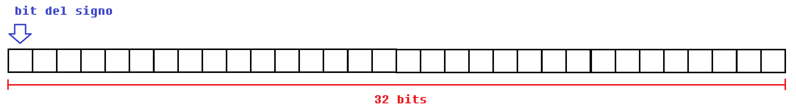

# Tipos de datos

<p align="justify">
En esta seccion veremos:

<ld>
<li>Tipos de datos numericos.
<li>Diferencias entre los tipo de datos numericos enteros y de punto flotante.
<li>Escribir constantes y declarar variables dependiendo del tipo de dato.
<li>Stuff printf() y scanf()
</ld>
</p>

<p align="justify">
C es un lenguaje fuertemente tipado, pero ¿que quiere decir esto?, por ejemplo en otros lenguajes de alto nivel, no tiene mucha relevancia definir explicitamente los tipos de datos que usaremos, podremos convertir una variable en otro tipo de dato facilmente. En C la cosa es totalmente diferente, en C debemos especificar los tipos de datos que vamos a manejar, ya que al definir esto podremos trabajar con ciertos rangos de numeros o podremos trabajarlos de una manera u otra. a lo largo de esta seccion trataremos estos aspectos en cada uno de los tipos de datos y se dara una vision de como se comporta en memoria.
</p>

<p align="justify">
¿Que tipos de datos existen en C?, dependiendo de la version pueden existir diferentes tipos de datos, pero inicialmente los tipos de datos que soportaba el lenguaje C en su version de ANSI-C eran estos.
</p>

**Tipos de datos iniciales numericos enteros**

```c
int long short char unsigned
```

**De punto flotante (reales)**

```c
float double
```

Unos años despues en la version c99 incluyo otros tipos de datos (aunque el unsigned o el signed no sea tipos de datos en concreto, con estos keywords se puede definir los datos de manera especifica como lo veremos mas adelante).

**tipo de dato con signo(para enteros) y tipo de dato vacio o sin tipo**

```c
signed void
```

En la version de c99 incluyeros soporte para tipo de datos de numeros imaginarios, numeros completos(parte real y parte imaginaria) y booleanos( True = 1 o False = 0).

```c
_Bool _Complex _Imaginary
```
Todas estos tipos de datos han sido agregados por las necesidades de los usuarios. la evolucion de los tipos de datos podremos consultar esto https://en.cppreference.com/w/c/types.

## Enteros

<p align="justify">
Si visualizamos los numeros desde el aspecto matematica, podremos ver los conjuntos numericos, apoyandonos de esto podremos tener un vision un poco mas amplia de nuestro rango de trabajo cuando estamos trabajando con tipos de datos enteros o otros tipos de datos usados en C.
</p>

<p align="center">

</p>

<p align="justify">
Si vemos en el conjunto numerico de los enteros podremos encontrar dos tipos de subconjuntos, los enteros positivos y los enteros negativos. En C no hay mucha diferencia de esto, podremos definir enteros con o sin signo. Los enteros normalmente tienen 32 bits (en procesadores de 32 y 64 bits). Entonces nuestra tarea (o mas bien la tarea del compilador) es poder representar representar numeros tanto enteros positivos como enteros negativos dentro de este espacio de memoria de 32 bits. La siguente imagen nos ayudara a hacernos una visualizacion mental de como se puede hacer esto.
</p>

<p align="center">

</p>

Como se puede ver en la imagen el bit mas significativo(el que tiene mayor valor representativo para la expresion) es usado para la representacion del signo (1 si es negativo, 0 si es positivo) el compilador entendera que este es un numero signado y no tomara en cuenta ese ultimo bit(solo lo tendra en cuenta para el criterio del signo), con esto podremos calcular el rango de trabajo de este tipo de dato numerico (cuando se habla de rango de trabajo se refiere al maximo numero que puede almacenar y el minimo numero que puede almacenar en una variable de este tipo de dato) en el int de 32 bits con signo (aunque si lo analizamos bien solo tenemos 31 bits de representacion numerica) podremos almacenar de -2,147,483,648 a 2,147,483,647. Pero si queremos almacenar mas numeros no positivos podremos definirlo desde la misma sintaxis de C.


```c
signed int variable0;     \* Declaracion de variable de tipo entero con signo *\
int variable1;            \* Declaracion de variable de tipo entero con signo *\

unsigned int variable2;   \* Declaracion de variable de tipo entero sin signo *\


```
