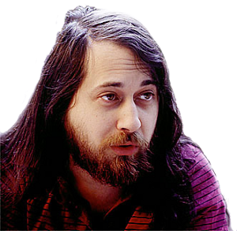

# Primer Acercamiento

Realizaremos un primer acercamiento a toda la onda del software libre y de su alrededor en diferentes aspectos como la filosofia y las libertidades, hablaremos un poco de su historia sobre como empezo y como evoluciono gracias al apoyo de diferentes desarroladores alrededor del mundo. Algunos argumentos de por que usar Gnu/Linux el dia a dia y a nivel tecnico en la vida informatica. Compararemos las diferentes licencias que existen y en cuales se mueve linux y algunos componentes de este y terminaremos explicando el paso a paso de como instalar xubuntu para poder trabajar algunas cosas mas adelante mientras se profundiza un poco mas el asunto.

## Filosofia del software libre y Breve Historia

El software libre es una propuesta para los usuarios de la informatica que brinda las libertades justas y necesarias poder usar un sistema o software viendo la transparencia de todo el proceso informatico realizado por el software.  

> El software es cada vez mas el gran intermediario entre la informacion y la inteligencia humana. De la misma manera que nos preocupa la libertad para poder acceder a la informacion y, si existe censura, nos debemos preocupar con igual intensidad quien controla este intermediario y que garantias tenemos de su transparencia y fiabilidad. Es por eso que el software tiene un papel muy destacado en la sociedad y es importante garantizar metodos transparentes en sus diferentes fases de produccion y explotacion. El software libre, al dar acceso al codigo es el unico que puede garantizar esta transparencia. 

Este movimiento social tiene como finalidad despertar la libertad del usuario, que el usuario sea consciente de que tiene derechos inherentes al momento de usar un sistema operativo o un software, a pesar que de que las grandes compañias de software y de sistemas operativos los omitan y vulneren estos derechos de los usuarios. Se debe acotar que **Software Gratuito** != **Software Libre**, existe la gran confusion que el software libre es software gratuito, Un software gratuito es un software que es llamado FreeWare el cual puede ser de libre uso pero por no podria dar el codigo fuente. o la redestribucion de este. Para poder saber si un software podria considerarse software libre debe cumplir con las libertades del usuario, que se nombraran mas adelante. 

**¿Pero quien inicio esto?**

La iniciativa empieza por Richard Stallman, fundador del movimiento por el software libre en el mundo. (Cabe decir que el creo GCC, GNU Emacs y el depurador GDB bajo el proyecto de GNU). En 1983 (despues de tener algunos lios tras la firma de un acuerdo de no divulgacion para que no liberara informacion y codigo sobre algunas de las implementaciondes privativas realizadas por parte del la compañia Symbolics) anuncio el inicio del proyecto GNU, que tiene como objetico crear un sistema operativo completamente libre, que fuera un alternativa completamente libre de usar UNIX y que fuera compatible con UNIX(GNU  significa GNU No es Unix).

    
    

Al poco tiempo de esto Fundo la organizacion Free Software Foundation (FSF) sin animo de lucro, con la mision de promover las libertades del usuario y defendiendolas a capa y espada.(por ejemplo reciemente estuvieron protestando por la desicion tomada de la neutralidad de internet). Frecuentemente despliega grandes campañas de promocion contra las aplicaciones informaticas de software privativo, entre las principales funciones tienen:

* Promover el uso de la distribucion GNU/Linux(linuxfree)
* Mantener el desarrollo del sistema operativo GNU
* Promover el remplazo de  las aplicaciones propietarias por aplicaciones libres
* Proveer licencias para los desarrolladores de software libre

Cabe destacar que el mecanismo de distribucion y proteccion de software o de algun material **copyleft** fue creados por FSF, dandole la oportunidad a diferentes desarrolladores y otras personas a liberar sus trabajos siendo de dominio publico pero sin poder usarse como software o trabajo privativo, protegiendo con ciertas licencias (se profundizara en esto mas adelante) el trabajo libre de los colaboradores, de algunos intermediarios con *malas intenciones$$*.

    

**Las 4 libertades que debe cumplir un software :**

* **Libertad 0 =** La libertad de ejecutar el programa como se desee, con cualquier proposito
* **Libertad 1 =** La libertad de estudiarlo como funciona el programa, y cambiarlo para lo que usted quiera. (el acceso al codigo fuente es necesario para esto)
* **Libertad 2 =** La libertad de redistribuir copias para ayudar a otros
* **Libertad 3 =** La libertad de distribuir copias de sus versiones modificadas a terceros. Esto le permito ofrecer a toda la comunidad la oportunidad de beneficiarse de las modificaciones. El acceso al codigo fuente es una condicion necesaria para ello.

    

> **Definicion temporal(Luego se profudizara en esto)**
> **KERNEL =** Nucleo o Kernel es un software que constituye la parte fundamental del sistema operativo, y se define como la parte que se ejecuta en modo privilegiado tambien conocido como modo kernel. Es el principal respoable de facilitar a los programas acceso seguro al hardware de la computadora, es el encargado de gestionar recursos, tambien se encarga de decidir que programa podra usar un dispositivo de hardware y durante cuanto tiempo. Acceder al hardware es un trabajo realmente complejo y normalmente los kernel tienen una capa de abstraccion de hardware, la cual facilita esta tarea.

GNU es un conjunto de herramientas algunas desarrolladas por el proyecto GNU y otras (de igual manera libres) tomadas de otros proyectos. Empezaron por el desarrollo de modulos que cumplieran ciertas tareas, entre esos Richard Stallman programo el compilador GCC. Para el kernel estaban realizando el Hurd, que es el nombre del kernel inicial de GNU, pero para la fecha no funcionaba completamente para ser puesto en produccion, afortunamente en 1991 Linus Torvals programo un kernel complatible con UNIX y lo denomino Linux, primeramente era un kernel privativo pero en 1992 lo convirtio en software libre. La combinacion del sistema operativo Gnu y del Kernel da al nombre GNU/Linux (Gnu con linux).

En lo largo del tiempo, el desarrollo del kernel tuvo una colaboracion muy grande a nivel mundial convirtiendose en uno de los kernels mas estables, No esta demas comentar que mientras mas grande se hacian las contribuciones por diferentes programadores (tanto modificando el sistema base GNU y al kernel linux) por medio de internet asi mismo se volvia una tarea compleja llevar un control de versiones, durante esa transicion Linus Torvals escribio el motor de control de versiones git (Usado hoy en dia como uno de los controles de versiones mas estables y de principal uso a la fecha). Gnu/Linux crecio mucho y empezaron a agruparse diferentes "colectivos" para realizar sus propias distribuciones de Gnu/linux, donde la instalacion y configuracion de este sistema fuera un poco mas amena. Durante este proceso varios de estos colectivos empezaron a recibir apoyo por ciertas empresa empezaron a recibir binarios (no codigo fuente, los binarios en raw) de ciertos fabricantes de componentes electronicos (Donde estos binarios eran firmware de algunos componentes del computador, siendo codigo privativo ya que solo hacian una implementacion del binario dentro del codigo mas liberan los drivers), con estos binarios el kernel linux empezaba a aumentar el soporte de ciertos componentes que antes no tenian soporte, pero rompiendo una de las libertades del software, convirtiendo el sistema GNU/Linux un sistema no tan libre como lo habia pensado richard stallman. 

De las distribuciones libres podemos consultar en [gnu.org/distros/free-distros.html](https://www.gnu.org/distros/free-distros.html) (donde podremos encontrar distribuciones completamente libres, sin codigo privativos en ellas, como por ejemplo trisquel o ProteanOS para sistemas embebidos) y no libres que podremos encontrar todo una gama de colores a nivel de sistema operativo en [Distro Watch](https://distrowatch.com/?language=ES) (tanto para sistemas desktop o servidores o sistemas embebidos).

**Beneficios y Contras de usar software totalmente libre**

> ¿Como se aprende a escribir bien el codigo? Con leer mucho codigo y escribir mucho codigo!!!

1. **Beneficios**
    * Al tener acceso al codigo fuente de las aplicaciones y del sistema operativo, lleva al entendimiento y al habito de lectura de codigo fuente, y esto a largo plazo lleva a que seamos mejores desarrolladores y tengamos una mejor compresion de la maquina
    * Seguridad
    * Robustex
    * Correcion de programas
    * Expansion
    * Consumo minimo de hardware
    * Estabilidad
    * Control de informacion
    * Independiencia tecnologica
    * Al usar y comprender el software libre es lleva un estado en el cual una comunidad de desarrolladores pongan una linea fuerte ante el software privativo creando vias alternativas para la evolucion de la tecnologia.
    * GoodBye agencias de espionaje y crackers, Teniendo unas buenas contramedidas en el sistema operativo no sera tan facil de penetrar y/o ser backdoorizado por personas externas
    * Gran apoyo tecnico por parte de la comunidad del software libre

2. **Contra**
    * Al rozar un poco la tendencia radical de solo usar software libre estariamos (o no) limitando el uso de nuestra maquina al no usar software privativo 
    * Todas las desventajas son superables teniendo en cuenta que esta en juego nuestra libertad

    

**Open Harware :** Existe un movimiento similar para el hardware (por ejemplo arduino es uno de estos proyectos de hardware libre) el cual el autor del hardware libra los esquimaticos y el firmware del hardware para el uso del publico bajo diferentes mecanismos de *copyleft* [MAS INFORMACION.](https://www.ecured.cu/Hardware_libre)

***Opinion personal (@s0d0m4) :***

     

Aunque el software privativo sea perjudicial para nuestros derechos como usuarios, el software privativo siempre nos brinda un reto bien llamativo, la ingenieria inversa.

> La ingenieria inversa es el proceso llevado a cabo con el objetivo de obtener informacion, diseño o mecanismos de un producto, con el fin de determinar cuales son sus componentes y de que maneran interactuan entre si.

Al realizar ingenieria inversa a productos privativos podriamos escribir versiones libres de controladores o firmware para ayudar a crecer el proyecto Gnu/Linux sin necesidad de instalar aplicaciones que probablemente vulnere la integridad de nuestra informacion, anonimato y libertades como usuarios. (En pocas palabras el software privativo es bueno para romperlo y analizarlo por un bien mayor).

## ¿Por que usar un sistema Gnu con kernel Linux?

## Comparacion de Licencias

## Instalacion de xubuntu(First Time Dude? Wellcome)

## Referencias

1. [Filosofia del sofware libre - MisionSucre - Stephenson Prieto](https://es.slideshare.net/Stephenson/filosofa-del-software-libre)
2. [Conferencia Richard Stallman - Software Libre (en español)](https://www.youtube.com/watch?v=f0slZnpELaU)
3. [Hardware Libre](https://www.ecured.cu/Hardware_libre)
4. [GNU org - Historia](https://www.gnu.org/gnu/gnu-history.html)
5. [Proyecto GNU](https://www.gnu.org/gnu/thegnuproject.html)
6. [FSF](https://www.gnu.org/philosophy/free-sw.es.html)
7. [FSF-ecured](https://www.ecured.cu/Free_Software_Foundation)
8. [Tech Talk: Linus Torvals on git](https://www.youtube.com/watch?v=4XpnKHJAok8)

