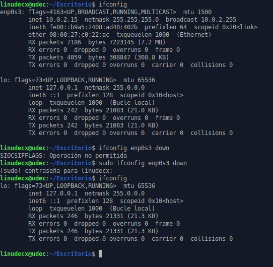

# Primer Acercamiento

<p align="justify">Realizaremos un primer acercamiento a toda la onda del software libre y de su alrededor en diferentes aspectos como la filosofia y las libertidades, hablaremos un poco de su historia sobre como empezo y como evoluciono gracias al apoyo de diferentes desarroladores alrededor del mundo. Algunos argumentos de por que usar Gnu/Linux el dia a dia y a nivel tecnico en la vida informatica. Compararemos las diferentes licencias que existen y en cuales se mueve linux y algunos componentes de este y terminaremos explicando el paso a paso de como instalar xubuntu para poder trabajar algunas cosas mas adelante mientras se profundiza un poco mas el asunto.</p>

## Filosofia del software libre y Breve Historia

<p align="justify">El software libre es una propuesta para los usuarios de la informatica que brinda las libertades justas y necesarias poder usar un sistema o software viendo la transparencia de todo el proceso informatico realizado por el software.</p>

> El software es cada vez mas el gran intermediario entre la informacion y la inteligencia humana. De la misma manera que nos preocupa la libertad para poder acceder a la informacion y, si existe censura, nos debemos preocupar con igual intensidad quien controla este intermediario y que garantias tenemos de su transparencia y fiabilidad. Es por eso que el software tiene un papel muy destacado en la sociedad y es importante garantizar metodos transparentes en sus diferentes fases de produccion y explotacion. El software libre, al dar acceso al codigo es el unico que puede garantizar esta transparencia. 

<p align="justify">
Este movimiento social tiene como finalidad despertar la libertad del usuario, que el usuario sea consciente de que tiene derechos inherentes al momento de usar un sistema operativo o un software, a pesar que de que las grandes compañias de software y de sistemas operativos los omitan y vulneren estos derechos de los usuarios. Se debe acotar que Software Gratuito != Software Libre, existe la gran confusion que el software libre es software gratuito, Un software gratuito es un software que es llamado FreeWare el cual puede ser de libre uso pero por no podria dar el codigo fuente. o la redestribucion de este. Para poder saber si un software podria considerarse software libre debe cumplir con las libertades del usuario, que se nombraran mas adelante.</p>

**¿Pero quien inicio esto?**

<p align="justify">La iniciativa empieza por Richard Stallman, fundador del movimiento por el software libre en el mundo. (Cabe decir que el creo GCC, GNU Emacs y el depurador GDB bajo el proyecto de GNU). En 1983 (despues de tener algunos lios tras la firma de un acuerdo de no divulgacion para que no liberara informacion y codigo sobre algunas de las implementaciondes privativas realizadas por parte del la compañia Symbolics) anuncio el inicio del proyecto GNU, que tiene como objetico crear un sistema operativo completamente libre, que fuera un alternativa completamente libre de usar UNIX y que fuera compatible con UNIX(GNU  significa GNU No es Unix).</p>

<p align="center">
    
    
</p>

<p align="justify">Al poco tiempo de esto Fundo la organizacion Free Software Foundation (FSF) sin animo de lucro, con la mision de promover las libertades del usuario y defendiendolas a capa y espada.(por ejemplo reciemente estuvieron protestando por la desicion tomada de la neutralidad de internet). Frecuentemente despliega grandes campañas de promocion contra las aplicaciones informaticas de software privativo, entre las principales funciones tienen:</p>

* Promover el uso de la distribucion GNU/Linux(linuxfree)
* Mantener el desarrollo del sistema operativo GNU
* Promover el remplazo de  las aplicaciones propietarias por aplicaciones libres
* Proveer licencias para los desarrolladores de software libre

<p align="justify">Cabe destacar que el mecanismo de distribucion y proteccion de software o de algun material copyleft fue creados por FSF, dandole la oportunidad a diferentes desarrolladores y otras personas a liberar sus trabajos siendo de dominio publico pero sin poder usarse como software o trabajo privativo, protegiendo con ciertas licencias (se profundizara en esto mas adelante) el trabajo libre de los colaboradores, de algunos intermediarios con malas intenciones$$.</p>

<p align="center">
    
</p>

**Las 4 libertades que debe cumplir un software :**

* **Libertad 0 =** La libertad de ejecutar el programa como se desee, con cualquier proposito
* **Libertad 1 =** La libertad de estudiarlo como funciona el programa, y cambiarlo para lo que usted quiera. (el acceso al codigo fuente es necesario para esto)
* **Libertad 2 =** La libertad de redistribuir copias para ayudar a otros
* **Libertad 3 =** La libertad de distribuir copias de sus versiones modificadas a terceros. Esto le permito ofrecer a toda la comunidad la oportunidad de beneficiarse de las modificaciones. El acceso al codigo fuente es una condicion necesaria para ello.

<p align ="center">
    
</p>

> **Definicion temporal(Luego se profudizara en esto)**
> **KERNEL =** Nucleo o Kernel es un software que constituye la parte fundamental del sistema operativo, y se define como la parte que se ejecuta en modo privilegiado tambien conocido como modo kernel. Es el principal respoable de facilitar a los programas acceso seguro al hardware de la computadora, es el encargado de gestionar recursos, tambien se encarga de decidir que programa podra usar un dispositivo de hardware y durante cuanto tiempo. Acceder al hardware es un trabajo realmente complejo y normalmente los kernel tienen una capa de abstraccion de hardware, la cual facilita esta tarea.

<p align="justify">
GNU es un conjunto de herramientas algunas desarrolladas por el proyecto GNU y otras (de igual manera libres) tomadas de otros proyectos. Empezaron por el desarrollo de modulos que cumplieran ciertas tareas, entre esos Richard Stallman programo el compilador GCC. Para el kernel estaban realizando el Hurd, que es el nombre del kernel inicial de GNU, pero para la fecha no funcionaba completamente para ser puesto en produccion, afortunamente en 1991 Linus Torvals programo un kernel complatible con UNIX y lo denomino Linux, primeramente era un kernel privativo pero en 1992 lo convirtio en software libre. La combinacion del sistema operativo Gnu y del Kernel da al nombre GNU/Linux (Gnu con linux).</p>

<p align="justify">
En lo largo del tiempo, el desarrollo del kernel tuvo una colaboracion muy grande a nivel mundial convirtiendose en uno de los kernels mas estables, No esta demas comentar que mientras mas grande se hacian las contribuciones por diferentes programadores (tanto modificando el sistema base GNU y al kernel linux) por medio de internet asi mismo se volvia una tarea compleja llevar un control de versiones, durante esa transicion Linus Torvals escribio el motor de control de versiones git (Usado hoy en dia como uno de los controles de versiones mas estables y de principal uso a la fecha). Gnu/Linux crecio mucho y empezaron a agruparse diferentes "colectivos" para realizar sus propias distribuciones de Gnu/linux, donde la instalacion y configuracion de este sistema fuera un poco mas amena. Durante este proceso varios de estos colectivos empezaron a recibir apoyo por ciertas empresa empezaron a recibir binarios (no codigo fuente, los binarios en raw) de ciertos fabricantes de componentes electronicos (Donde estos binarios eran firmware de algunos componentes del computador, siendo codigo privativo ya que solo hacian una implementacion del binario dentro del codigo mas liberan los drivers), con estos binarios el kernel linux empezaba a aumentar el soporte de ciertos componentes que antes no tenian soporte, pero rompiendo una de las libertades del software, convirtiendo el sistema GNU/Linux un sistema no tan libre como lo habia pensado richard stallman. </p>

<p align="justify">
De las distribuciones libres podemos consultar en https://www.gnu.org/distros/free-distros.html (donde podremos encontrar distribuciones completamente libres, sin codigo privativos en ellas, como por ejemplo trisquel o ProteanOS para sistemas embebidos) y no libres que podremos encontrar todo una gama de colores a nivel de sistema operativo en https://distrowatch.com/?language=ES (tanto para sistemas desktop o servidores o sistemas embebidos).</p>


**Beneficios y Contras de usar software totalmente libre**

> ¿Como se aprende a escribir bien el codigo? Con leer mucho codigo y escribir mucho codigo!!!

1. **Beneficios**
    * Al tener acceso al codigo fuente de las aplicaciones y del sistema operativo, lleva al entendimiento y al habito de lectura de codigo fuente, y esto a largo plazo lleva a que seamos mejores desarrolladores y tengamos una mejor compresion de la maquina
    * Seguridad
    * Robustex
    * Correcion de programas
    * Expansion
    * Consumo minimo de hardware
    * Estabilidad
    * Control de informacion
    * Independiencia tecnologica
    * Al usar y comprender el software libre es lleva un estado en el cual una comunidad de desarrolladores pongan una linea fuerte ante el software privativo creando vias alternativas para la evolucion de la tecnologia.
    * GoodBye agencias de espionaje y crackers, Teniendo unas buenas contramedidas en el sistema operativo no sera tan facil de penetrar y/o ser backdoorizado por personas externas
    * Gran apoyo tecnico por parte de la comunidad del software libre

2. **Contra**
    * Al rozar un poco la tendencia radical de solo usar software libre estariamos (o no) limitando el uso de nuestra maquina al no usar software privativo 
    * Todas las desventajas son superables teniendo en cuenta que esta en juego nuestra libertad


<p align="center" >
    
</p>


**Open Harware :** <p align="justify">Existe un movimiento similar para el hardware (por ejemplo arduino es uno de estos proyectos de hardware libre) el cual el autor del hardware libra los esquimaticos y el firmware del hardware para el uso del publico bajo diferentes mecanismos de *copyleft* MAS INFORMACION en https://www.ecured.cu/Hardware_libre.</p>


***Opinion personal (@s0d0m4) :***

<p align="center" >
     
</p>

<p align="justify">
Aunque el software privativo sea perjudicial para nuestros derechos como usuarios, el software privativo siempre nos brinda un reto bien llamativo, la ingenieria inversa.</p>

> La ingenieria inversa es el proceso llevado a cabo con el objetivo de obtener informacion, diseño o mecanismos de un producto, con el fin de determinar cuales son sus componentes y de que maneran interactuan entre si.


<p align="justify">Al realizar ingenieria inversa a productos privativos podriamos escribir versiones libres de controladores o firmware para ayudar a crecer el proyecto Gnu/Linux sin necesidad de instalar aplicaciones que probablemente vulnere la integridad de nuestra informacion, anonimato y libertades como usuarios. (En pocas palabras el software privativo es bueno para romperlo y analizarlo por un bien mayor).</p>

## ¿Por que usar un sistema Gnu con kernel Linux?

## Comparacion de Licencias

## Instalacion de xubuntu(First Time Dude? Wellcome)

### ¿Que es xubuntu?

<p align="center">
    
</p>

> Xubuntu is an elegant and easy-to-use operating system. Xubuntu comes with Xfce, which is a stable, light and configurable desktop environment.
> It is perfect for those who want to make the most of their desktops, laptops and netbooks, featuring a modern look and enough features for efficient, daily usage. It works well on older hardware too.

<p align="justify" >Xubuntu es un sistema netamente ubuntu pero con un ambiente de escritorio(Los sistemas gnu/linux y sus derivados permiten montar sobre el sistema operativo diferentes ambientes de escritorio, son los encargados brindarle una interface mediana mente amigable al usuario) diferente al que viene por defecto en ubuntu, el ambiente de escritorio se llama XFCE, es un ambiente de escritorio mucha mas liviano, rapido y amigable con el usuario final. Si nuestro equipo no tiene tanto aguante grafico y quieres una interface amigable esta podria ser una solucion a esa necesidad.
</p>
<p align="justify">
Si miramos los requerimientos minimos que pide xubuntu podremos conclucuir que este es un es un sistema operativo para una maquina no tan buena en hardware.
</p>

* CPU: 1.0Ghz+ (needs to support PAE)
* RAM: 512MiB+ for Desktop/LiveCD
* Hard drive space: 7.5GB
* Graphics card and monitor capable of 800×600 resolution

Para tener una mejor experiencia grafica es recomendable tener 1G de memoria, 20GB en espacio de disco.

Aunque existen sistemas mucho mas livianos que este.

### Obtener Xubuntu

Xubuntu se puede obtener en la pagina del proyecto www.xubuntu.org, existen varias formas de obtener la distro, por medio de torrent o de http, usaremos el protocolo http para realizar esta descarga, ingresamos a http://www.mirrorservice.org/sites/cdimage.ubuntu.com/cdimage/xubuntu/releases/18.04/release/ y nos descargamos xubuntu-18.04-desktop-amd64.iso o para sistemas de 32 bits xubuntu-18.04-desktop-i386.iso.

<p align="center">

</p>

### Formas de booteo y uso de una iso

<p aling="justify">
Para poder hacer uso de esa iso que recien descargamos, podriamos quemar un DVD con esta iso o crear una memoria booteable(se hara un laboratorio mas adelante) y usarla como LIVECD en un equipo(el modo LIVECD nos permite probar una distribucion linux sin tener que tenerla instalada en nuestro equipo, ya que el modo LIVECD se monta sobre la memoria ram y no sobre el disco duro). Otra forma de probar distribuciones es la virtualizacion(Es la creacion de una maquina a traves del software sienda esta una abstraccion de una maquina, la cual comparte recursos de la maquina anfitriona(maquina real) con la maquina huesped(maquina virtualizada)). De estas formas de profundizara posteriormente.
</p>

### Mensaje de carga de la distribucion

<p aling="justify">
Normalmente las distribuciones al cargar el sistema(ya sea instalado o en livecd) muestran la carga del sistema sobre el hardware, pero ya que xubuntu es una distribucion amigable con el usuario no le muestra esta informacion para que no se asuste.
</p>

<p align="center">

</p>

Despues de realizar la carga del sistema, aparece dos opciones, si quieremos montar el sistema como LIVECD o proceder a la instalacion, tambien nos mostrara que idioma podremos usar. 

<p align ="center">

</p>

Procederemos con la instalacion.

### Instalacion

Despues de seleccionar el procedimiento de instalacion, nos mostrara el menu de seleccion de la distribucion del teclado(normalmete la distribucion del teclado es español(latinoamericano), Seleccionamos y pasamos al siguente menu.

<p align ="center">

</p>

<p align="justify">
En este menu nos aparecera la opcion la opcion de actualizaciones y otro software, donde podremos marcar si queremos descargar las actualizaciones mientras se instala xubuntu (eso nos facilitara el trabajo mas adelante en cuando ingresemos al sistema operativo y no tengamos que actualizarlo Comando: sudo apt-get update). Tambien nos dara la posibilidad de instalar paquetes privitavos dentro de nuestra distribucion, para poder tener soporte a nuestro hardware especifico, (esto es a lo que se referia richard stallman)</p>

<p align ="center">

</p>

<p aling="justify">
En esta parte tendremos que definir que particiones vamos a usar y como las vamos a usar, si detectara algun otro sistema operativo, la instalacion lo dectara y dara la opcion de instalarlo junto a la particion del sistema operativo que tenemos. En esta seccion lo ideal es poder configurar las particiones como nosotros queramos, poder crear volumnes cifrados, crear la particion de area de intercambio entre otros.
</p>

<p align ="center">

</p>

<p aling="justify">
Al terminar de configurar nuestras particiones nos mostrar una advertencia sobre si queremos escribir la configuracion para la instalacion, en este momento es critico ya que si no se configuro bien las particiones, podriamos perderla otra particion.
</p>

<p align ="center">

</p>

En esta parte debemos definir la zona horaria donde habitamos, para cuando la hora se sincronice con los servidores de ubuntu tener la hora de nuestra zona y no tener algunos conflictos en el sistema.

<p align="center">

</p>

<p aling="justify">
En este momento configuramos nuestro usuario (normalmente siempre el usuario tiene la posibilidad de tener N usuarios, pero en distribuciones mas configurables podriamos tener las sesiones de root y la del usuario, la sesion de root es del super administrador, el cual tiene poderes sobre todo el equipo), ingresamos los datos requeridos y con estos datos iniciaremos la sesion en nuestro computador.
</p>

<p align ="center">

</p>

Inicia la instalacion(la descarga, configuracion y instalacion de paquetes base del sistema, entorno , etc)

<p align ="center">

</p>

Al terminar la instalacion salimos del modo LIVECD reiniciando el equipo para iniciar ya con el sistema recien instalado

<p align ="center">

</p>

Debemos iniciar nuestra sesion con los datos suministrados en el menu de la instalacion

<p align ="center">

</p>

Y nuestro sistema queda instalado, xubuntu al ser una distribucion muy amigable con el usuario final, nos preconfigura todo nuestro sistema para que solo sea iniciar y empezar a usarlo.

<p align ="center">

</p>

**Este sistema operativo sera usado mientras se aprenden los fundamentos basicos para empezar con una transicion a nuestra distribucion core del semillero DEBIAN... Debian nos brindara el reto de poder realizar ciertas configuraciones por nuestra cuenta y la personalizacion total de nuestro sistema, nos brindara un sistema base**

### Comandos basicos para moverse entre directorios, administracion de red, documentacion de los programas

<p align="justify">
Para empezar una interacion un poco mas cercana con el sistema operativo debemos usar la terminal, la terminal nos brinda una interfaces con los programas base y otros programas que tengamos instalados y la administracion de nuestro sistema mediante un conjunto de programas base del sistema operativo, el poder de la terminal es bastante poderosa a comparacion de solo la administracion por la interface grafica que nos brinda el sistema operativo. Para tener en cuenta de unos comandos base que poder defendernos un poco por medio de la terminal son los siguentes:
</p>

**Moverse entre directorios**

<p align="justify">
Recien nosotros abrimos nuestra terminal de comandos ella misma nos ubica en nuestra carpeta personal (/home/miCarpetaPersonal) esta carpeta es nuestra area de trabajo en la cual podemos guardar nuestros archivos alli como Documentos, Descargas, Imagenes, Musica y Escritorio. para poder visualizar que archivos y carpetas tenemos dentro de nuestra carpeta personal ejecutar el comando 'ls', este comando nos listara todos los directorios y archivos.
</p>

<p imagen align="center">

</p>

<p align="justify">
Como podemos ver en la imagen, si visualizamos nuestros archivos por un gestor de archivos visual podremos ver que tenemos el mismo resultado(lista los directorios y archivos) que al usar el comando ls, Aqui entre el poder de los comandos, yo por medio de comandos puedo habilitar unas opciones propias del programa por ejemplo cuando ejecutamos el mismo comando 'ls -a' con esto le estamos diciendo a nuestro programa ls que me liste todos los directorios y archivos asi esten ocultos. Podemos ver tenemos directorios ocultos y visualizamos que los directorios y archivos ocultos en linux, vemos que aparecen unos puntos en azul, esos puntos equivalen a carpetas o a posiciones relativas que hablaremos mas adelante de esto.
</p>

<p imagen align="center">

</p>

<p alig="justify">
Otro comando es el comando cd, si yo quiero entrar a una de las carpetas que acabo de visualizar con el comando 'ls', solo debo colocar el comando 'cd nombreCaperta' y el nombre de la carpeta que yo quiero ingresar. Con estos dos comandos puedo navegar por mis directorios tanto de mi carpeta personal como otros archivos y carpetas del sistema. Pero que pasa si quiero devolverme a la carpeta anterior donde estaba ubicado, para eso son las carpetas ocultas de los puntos que antes hablabamos, al ejecutar el programa 'cd ..' y le pasamos como argumento al nombre de la carpeta '..', lo que nos estamos refiriendo es que vamos a ingresar a la carpeta atras de la carpeta donde estoy ubicado. cd tambien acepta como argumentos rutas largas de carpetas, por ejemplo si yo quisiera ingresar a mi carpeta personal 'cd /home/micarpeta', dentro de la carpeta 'home' van a estar todas las carpetas de los usuarios creados para el sistema (a excepcion de la carpeta del administrador root) entonces ahi estamos diciendo "voy a ir a la carpeta 'micarpeta' que esta ubicada dentro de la carpeta 'home'
</p>

**Administrar interfaces de red**

<p align="justify">
Uno de los comandos basicos de administracion de red, es el comando 'ifconfig', el comando ifconfig es un programa base del sistema, el cual podemos usar para consultar las interfaces de red que tiene mi equipo (por ejemplo wlan y la ethernet). vamos a realizar 3 cosas con este programa. 1) consulta de las interfaces de red que poseemos, 2) deshabilitar una de nuestras interfaces de red y 3) volver a habilitar nuestra interface que anteriormente dehabilitamos.
</p>

```bash 
ifconfig                            # consultar cuales son nuestras tarjetas de red
```

<p align="center">

</p>

<p align="justify">
Como podemos ver, al ejecutar nuestro comando de consulta podemos visualizar las interfaces de red que tenemos trabajando, la cual poseemos la **enp0s3** que seria equivalente a nuestro tarjeta de red ethernet, la otra interface local o **lo** la interface local es un mecanismo de red usado para referirse a si mismo (este computador) muy usado para testear software en fase de desarrollo, por eso cuando instalamos xampp podemos testear nuestro server web con http://localhost/. Tambien
como podemos visualizar podemos encontra nuestro numero ip asigando en cada una de las interfaces(ethernet:10.0.2.15 y localhost:127.0.0.1) 
</p>

```bash
sudo ifconfig enp0s3 down                # deshabilitar la interface de red de ethernet
```

<p align="center">

</p>

<p align="justify">
Digamos que por x o y razon nuestra interface de red, no tiene asignada ninguna ip, tal vez hubo algun problema, una forma de intentar arreglar esto es probando, deshabilitando y habilitando la tarjeta de red, con el mismo comando ifconfig, pasandole como argumentos el nombre de la tarjeta de red y una accion (en esta caso down para deshabilitarla) podemos decirle a nuestra interface de red que se "apague" por asi decirlo, cuando intentamos volver a consultar podemos ver que nuestra
interface de red ya no esta.
</p>

<p align="justify">
Pero que es ese sudo, ese es otro comando, que nos permite ejecutar aplicaciones como administrador (como cuando se le da click derecho a un binario en windows y se le da click en "ejecutar como administrador") con esto estamos diciendo "ejecuteme en modo administrador el programa ifconfig para poder deshabilitar la tarjeta de red ethernet".
</p>

```bash
sudo ifconfig enp0s3 up                  # habilitar la interface de red de ethernet
```

**Manuales de los programas**

```bash
man ls
man man
```

<p align="center">

</p>

<p align="justify">
Normalmente los programas que se instalan en linux vienen con su propia documentacion, para poder usar con mucho mas poder cada una de estas herramientas y poder saber como ejecutarlas y de que forma pasarle argumentos para habilitar otras funcionabilidades internas del programa.
</p>

## Referencias

1. [Filosofia del sofware libre - MisionSucre - Stephenson Prieto](https://es.slideshare.net/Stephenson/filosofa-del-software-libre)
2. [Conferencia Richard Stallman - Software Libre (en español)](https://www.youtube.com/watch?v=f0slZnpELaU)
3. [Hardware Libre](https://www.ecured.cu/Hardware_libre)
4. [GNU org - Historia](https://www.gnu.org/gnu/gnu-history.html)
5. [Proyecto GNU](https://www.gnu.org/gnu/thegnuproject.html)
6. [FSF](https://www.gnu.org/philosophy/free-sw.es.html)
7. [FSF-ecured](https://www.ecured.cu/Free_Software_Foundation)
8. [Tech Talk: Linus Torvals on git](https://www.youtube.com/watch?v=4XpnKHJAok8)
