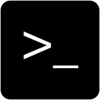

# Comandos de supervivencia

<p align="center">

</p>

<p align="justify">
En esta seccion se trataran algunos comandos de supervivencia dentro del sistema operativo Gnu/linux, Solo se mostrara su modo de uso y se dejara una breve descricion de la funcionbilidad que tiene, en temas posteriores se realizara la profundizacion sobre esto.
</p>

<p align="justify">
Para el uso basico de los comandos dentro de la terminal de Gnu/Linux, debemos saber que al ejecutar un programa o dar uso de un comando por medio de la CLI (command line interface) podemos utilizar una serie argumentos (definidos en el mismo programa) que nos permite extender la funcionabilidad del programa.
</p>

>comando *argumento-1 argumento-2 argumento-3 ... argumento-N*

<p align="justify">
Para encontrar los argumentos o ver la forma del uso de los programas podremos consultar en las paginas man de linux, tan solo debemos ejecutar (con esto nos mostrar la documentacion oficial del programa que vamos a ejecutar). o con el argumento --help o -h, cambia dependiendo del programa.
</p>

> man *comando*

> comando *--help -h*

## cat

<p align="justify">
El comando cat, puede concatenar diferentes archivos mostrandolos por pantalla o redireccionando el resultado concatenado a un nuevo archivo o simplemente mostrar el contenido de un archivo por consola.
</p>

```bash
cat fichero1.txt fichero2.txt fichero3.txt
```
O para solo mostrar el contenido de un solo archivo

```bash
cat fichero.txt
```

## cd

<p align="justify">
El comando cd nos permite movernos entre los directorios por medio de la terminal de comandos. normalmente cuando ejecutamos una terminal de comandos, la terminal nos posiciona en nuestra carpeta personal (/home/usuario) y a partir de aqui podremos movernos en diferentes direcciones, ya sea para una carpeta adentro de nuestra carpeta o mas atras.
</p>

```bash
#uso basico
cd nombre_carpeta

# ubicarnos en nuestra carpeta personal
cd /home/usuario/micarpeta
cd ~/micarpeta

# retroceder una carpeta hacia atras
cd ..      
```

## ls

<p align="justify">
El comando ls nos lista los directorios y los archivos de una carpeta en especifica. Si lo ejecutamos sin darle informacion inicial, nos listara los directorios de la carpeta donde estamos ubicados.
</p>


```bash
#uso basico
ls

# listar de manera especifica
ls /home/usuario/carpeta_listar/

# lista solo los archivos que terminen en .txt
ls /home/usuario/carpeta_listar/*.txt

# listar todos los archivos con toda la informacion
# permisos , propietario, tamaño, creacion
ls -al     
```

## du

<p align="justify">
Con el comando du, estima el espacio usado por una carpeta especifica.
</p>

```bash
#uso basico
du -sh /home/usuario/capeta_medir
```
## file

<p align="justify">
Comunmente dentro de los sistemas Gnu/Linux se encuentran ficheros sin extension. Usamos el comando file para saber que tipo archivo es. El comando file toma una serie "headers" de archivos que tiene almacenados en el sistema operativo y empieza a hacer una comparacion con la estructura binaria del fichero y con eso detecta que tipo de fichero es el que le estamos pasando como argumento
</p>

```bash
#uso basico
file archivo_desconocido
file /home/usuario/archivo_des*
```

## mkdir

<p align="justify">
Para crear carpetas usamos el comando mkdir.
</p>

```bash
#uso basico
mkdir carpeta
mkdir ../carpeta
```
## mv

<p align="justify">
El comando mv nos permite mover varios archivos a un directorio en concreto. Tambien nos permite la posibilidad de renombrar archivos
</p>

```bash
#uso basico
mv file1 file2 file3 /home/usuario/carpeta/

# renombrar archivo
mv file1 NewCoolFile
```

## less | more

<p align="justify">
Los comandos less y more nos permite tener una visualizacion un poco interactiva de algun archivo. para desplazarnos por el archivo podemos hacerlo con las teclas arriba y abajo
</p>

```bash
#uso basico
less archivo
more archivo
```
<p align="center">

</p>

## clear

<p align="justify">
Con el comando clear limpiamos el buffer de la terminal, limpiando nuestra vision de trabajo sobre la terminal
</p>

```bash
#uso basico
clear
```
## rm
<p align="justify">
El comando rm nos permite borrar archivos y con unos argumentos mas, nos permite borrar carpetas completas.
</p>

```bash
# uso basico
rm /home/usuario/archivo.txt

# borrar todo el contenido de una carpeta
rm -rf /home/usuario/carpeta
```

## cp

<p align="justify">
El comando cp, nos permite copiar archivos de una carpeta a otra.
</p>

```bash
# forma basica
cp ~/carpeta/archivo.txt /home/carpeta/archivo.txt

# copiar carpeta
cp -r ~/carpeta /home/
```

## nano

<p align="justify">
Nano es una herramienta de edicion de archivos por medio de la linea de comandos, existen otras alternativas como vim o emacs pero para empezar esta bien.
</p>

```bash
nano archivo.c
```

<p align="center">

</p>

## mc

<p align="justify">
La herramienta mc, nos brinda un interface amigable para el usuario la cual podemos usar para manipular archivos y directorios del sistema, este tipo de interface lleva el nombre de TUI. Podemos copiar, eliminar y mover con solo unos cuantos clicks o moviendose con el teclado.
</p>

```bash
mc
```

<p align="center">

</p>

## curl

<p align="justify">
La herramienta curl nos brinda la oportunidad de realizar peticiones http o ftp o de otros protocolos, en pocas palabras con curl podemos interacturar con estos protocolos para realizar ciertas acciones.
</p>

<p align="justify">
Por ejemplo estamos desarrollando una aplicacion web o un api rest y deseamos probar algunas de las peticiones http (get o post) contra este servicio que estamos desarrollando. con curl lo podemos hacer.
</p>

```bash
## enviando peticion get
curl https://curl.haxx.se

## enviando peticion post
curl -X POST --data "birthyear=1905&press=%20OK%20"  http://www.example.com/when.cgi
```

## htop

<p align="justify">
htop es una herramienta interactiva de monitoreo de procresos (se podria decir que es una alternativa de el administrador de tareas de windows solo que mas avanzada y para linux).
</p>

```bash
htop
```

<p align="center">

</p>

## Busqueda y instalacion de paquetes en el repositorio

<p align="justify">
Para la instalacion y actualizacion de software que podemos instalar en nuestras distribuciones (existen otras formas pero esta es la mas usada por la misma facilidad), es por medio de los repositorios oficiales de la distribucion (sea Debian o ubuntu) con los siguentes comandos podremos actualizar, buscar y instalar paquetes en nuestra distribucion.
</p>

```bash
# actualizar lista del repositorio con las lista local
sudo apt-get update

# buscar paquetes
sudo apt-cache search paquete

# instalar paquetes
sudo apt-get install paquete
```

## Ejecutar programas en background

<p align="justify">
La terminal de comandos nos permite ejecutar programas o comandos en forma de background, sin tener la visualizacion en el momento para poder realizarlo. Se podria decir como se ejecuta en modo oculto y cuando termine lo que tiene que hacer nos devolvera un mensaje por consola avisando que ya termino la tarea especificada.
</p>

```bash
# ejecucion
> cp ~/Descargas/archivo_grande.img /home/usuario &

# respuesta
[1] + 13353 done cp ~/Descargas/archivo_grande.img /home/usuario
```

## Cool Cheat Sheet
<p lign="center">
<br><br>

</p>
