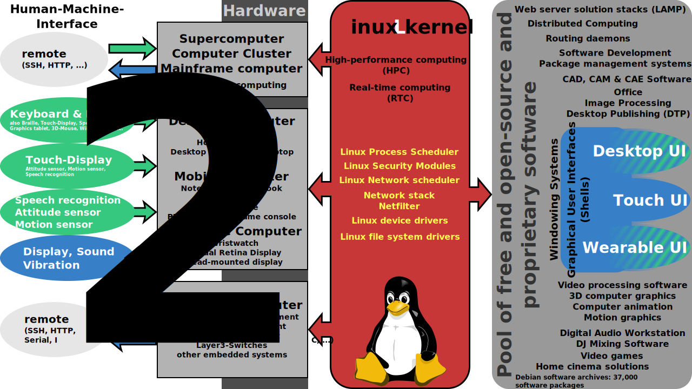

# Sistemas Operativos

<p align="justify">
Para iniciar con una definicio del sistema operativo cabe resaltar cuales son los actores que interactuan dentro de un sistema informatico:
</p>

* **Hardware** (Procesador, memoria, dispositivos de entrada y salida de datos)
* **Software** (Aplicaciones del sistema, aplicaciones de los usuarios)
* **Personas** (Usuarios en general, Administradores, Programadores)

<p align="justify">
Un sistema operativo(SO) es el software intermediario entre el hardware y los usuarios. Es encargado de proveer un entorno para poder ejecutar programas, administrar eficientemente los recursos del computador (hardware), facilitar la interaccion con el computador, gestionar y optimizar los recursos del computador, resolver algunos conflictos, facilitar la evolucion del software y del hardware y otras (Sonara un poco redundante pero el sistema operativo se puede ver como el conjunto de software que permite que el sistema informatico sea operativo).
</p>

## Roles del sistemas operativo

### 1. Sistema operativo como interface del hardware

<p align="justify">
Al ver el sistema operativo como una interface del hardware, se pueden añadir caracteristicas no existentes en el hardware(Por ejemplo que un hardware no tenga funciones para operaciones de punto flotante, pero por mediod el sistema operativo se podria escribir estas funciones virtuales que realicen estas operaciones). Tambien permite ocultar errores que aveces ocurren en el hardware (El sistema operativo esta pendiente de los errores que ocurren en el hardware y cuando ocurre alguno, se puede capturar y realizar ciertas acciones cuando esto pase, evitando mostrar el error del hardware). Al tener el sistema operativo como una interface del hardware, nos ofrece una maquina extendida (por este concepto es posible realizar virtualizacion sobre el hardware con ayuda del software, permitiendo tomar recursos fisicos y emular algunos mecanimos faltantes para poder montar una maquina dentro de otra maquina).
</p>

<p align="justify">
El sistema operativo envuelve el hardware en una capa abstracta permitiendonos ampliar ciertas caracteristicas no presentes en el hardware y a su vez oculta algunos detalles "incomodos" del hardware.
</p>

<p aling="center">

</p>

#### Interfaces del sistema operativo

<p align="justify">
Si vemos desde el punto de vista desde usuario podremos obtener 3 interfaces o entornos de trabajo, estas interfaces o entornos de trabajo nos brinda una forma amigable de trabajo sobre el sistema operativo. Ya que dentro de este sistema informatico tenemos 3 roles a simple vista (Usuario final, Administradores, Programadores). El sistema operativo suele proporcionar utilidades basicas para que el usuario pueda desempeñar diferentes tareas, aprovechando las interfaces dadas por el sistema operativo. Por ejemplo trabajar con discos y con archivos, Ejecutar aplicaciones (cargador de programas), imprimir, administracion del sistema o usar funciones del sistema para escribir sus propias aplicaciones.
</p>

##### **Usuarios finales =** Interface de ejecucion y trabajo sencillo (GUI).

<p align="justify">
Los usuarios finales, son aquellos usuarios que no tienen conocimiento tecnico sobre el sistema operativo y su finalidad es usar el sistema operativo para el dia a dia (trabajo, ofimatica, redes sociales, etc). El aspecto que tiene esta interface es completamente grafica y lleva como nombre GUI (Graphical User Interface). La GUI de un sistema operativo es un programa informatico que actua como una interface de usuario, usando un conjunto de imagenes y objetos graficos, brindando un entorno visual sencillo para permitir la comunicacion del sistema operativo y el usuario final. (por ejemplo windows tiene el proceso explorer.exe que es el encargado de darle todo el aspecto visual a sistema operativo, si buscamos diferentes entornos graficos para linux encontramos de todas las formas y sabores). Acontinuacion podremos ver dos tipos de GUI totalmente diferentes, entre el usuario se familiariza con el sistema, podra personalizar la GUI a su antojo.
</p>


<p align="center">


</p>

<p align="justify">
Una buena forma de ver como es mas o menos la arquitectua del servicio GUI de los sistemas operativos GNU/linux, se empieza con el usuario interacturando con la interface grafica (pueden existir muchos tipos de interface grafica como gnome o kde o xfce), Luego viene el protocolo de comunicacion entre la interface grafica y el servidor de pantalla, el cual tiene comunicacion directa con el gestor de ventanas, y el servidor de pantalla o tambien conocido como servidor grafico tiene interaccion directa con el kernel, el kernel se encarga de hacer las manipulaciones necesarias en el hardware para poder brindar el uso de la GUI.
</p>

<p align="center">

</p>

##### **Administradores =** Interface de administracion (CLI)

<p align="justify">
Los administradores del sistema operativo, son aquellos usuarios que tienen conocimiento tecnico de la configuracion y administracion del sistema y se necesita expandir mas la interface con la que interactuan, ya que deben acceder a los servicios del sistema. La interface de administracion se extiende a un lenguaje sencillo para dar instrucciones al sistema operativo por medio de comandos llamada CLI (Console Line Interface). Esta extension se llama shell, es una interprete de comandos del sistema que provee una interface administrativa para acceder a los servicios del sistema operativo. La mayoria de instrucciones que interpreta o se ejecutan dentro de la shell son programas ubicados dentro de ciertas carpetas del sistema (ejem: Windows -> C:/Windows/System32 o Linux -> /usr/bin ), Estos programas estan hechos especialmente para ser ejecutados via la linea de comandos.
</p>

<p align="justify">
Acontinuacion veremos dos ejemplos de como consultar los programas que se estan ejecutando en la maquina, tanto en linux como en windows respectivamente.
</p>

<p align="center">


</p>

##### **Desarrolladores =** Interface de programacion (API)

<p align="justify">
El sistema operativo ofrece a los desarrolladores y a los procesos, un conjunto de servicios publicos, accesible mediante el API. Como podemos ver en la siguente grafica, por medio de la libreria de GNU C, podremos conseguir esta interface programable, la cual nos permitira tener control sobre procesos, administracion de memoria, sockets, y acceso a los drivers del sistema operativo.

</p>
<p align="center">

</p>

Ejemplo, funcion fchmod, funciona igual chmod en linux, informacion sacada de -> http://man7.org/linux/man-pages/man3/fchmod.3p.html

```
PROLOG         

       This manual page is part of the POSIX Programmer's Manual.  The Linux
       implementation of this interface may differ (consult the
       corresponding Linux manual page for details of Linux behavior), or
       the interface may not be implemented on Linux.

NAME        

       fchmod — change mode of a file

SYNOPSIS         

       #include <sys/stat.h>

       int fchmod(int fildes, mode_t mode);

DESCRIPTION         

       The fchmod() function shall be equivalent to chmod() except that the
       file whose permissions are changed is specified by the file
       descriptor fildes.

       If fildes references a shared memory object, the fchmod() function
       need only affect the S_IRUSR, S_IWUSR, S_IRGRP, S_IWGRP, S_IROTH, and
       S_IWOTH file permission bits.

       If fildes references a typed memory object, the behavior of fchmod()
       is unspecified.

       If fildes refers to a socket, the behavior of fchmod() is
       unspecified.

       If fildes refers to a STREAM (which is fattach()-ed into the file
       system name space) the call returns successfully, doing nothing.

RETURN VALUE         

       Upon successful completion, fchmod() shall return 0. Otherwise, it
       shall return −1 and set errno to indicate the error.

ERRORS         

       The fchmod() function shall fail if:

       EBADF  The fildes argument is not an open file descriptor.

       EPERM  The effective user ID does not match the owner of the file and
              the process does not have appropriate privileges.

       EROFS  The file referred to by fildes resides on a read-only file
              system.

       The fchmod() function may fail if:

       EINTR  The fchmod() function was interrupted by a signal.

       EINVAL The value of the mode argument is invalid.

       EINVAL The fildes argument refers to a pipe and the implementation
              disallows execution of fchmod() on a pipe.

       The following sections are informative.

EXAMPLES         

   Changing the Current Permissions for a File
       The following example shows how to change the permissions for a file
       named /home/cnd/mod1 so that the owner and group have
       read/write/execute permissions, but the world only has read/write
       permissions.

           #include <sys/stat.h>
           #include <fcntl.h>

           mode_t mode;
           int    fildes;
           ...
           fildes = open("/home/cnd/mod1", O_RDWR);
           fchmod(fildes, S_IRWXU | S_IRWXG | S_IROTH | S_IWOTH);

APPLICATION USAGE        

       None.

RATIONALE         

       None.

FUTURE DIRECTIONS         

       None.

SEE ALSO         

       chmod(3p), chown(3p), creat(3p), fcntl(3p), fstatat(3p),
       fstatvfs(3p), mknod(3p), open(3p), read(3p), write(3p)

       The Base Definitions volume of POSIX.1‐2008, sys_stat.h(0p)

```
<p align="justify">
Otra vision a nivel general que podemos tener es visualizando las funciones netas del kernel y el syscall que hace el kernel para ciertas operaciones. Uno de los objetivos principales de este semillero de investigacion es comprender y programar dando uso de estas funciones.
</p>

<p align="center">

</p>

<p align="center">

</p>

### 2. Sistema operativo como administrador de recursos

Antes de hablar del sistema operativo como administrador de recursos debemos dar una pequeñas definiciones sobre procesos y recursos.

**Proceso**
<p aling="justify">
Una unidad de actividad que se caracteriza por la ejecución de una secuencia de instrucciones, un estado actual, y un conjunto de recursos del sistema asociados. Cada uno de estos procesos tienen instrucciones a ejecutarse, memoria donde ejecutarse, recursos fisicos que accederan para hacer ciertas acciones, un estado de ejecucion y otra informacion que permite al sistema operativo realizar ciertas acciones.
</p>

**Recurso**
<p aling="justify">
Espacios fisicos o virtuales que necesita un proceso para ejecutarse, puede verse como la memoria que ocupa un proceso para poder ejecutarse, tambien puede verse como el hardware que el proceso en llegado caso utilizara para realizar cierta accion.
</p>

<p aling="justify">
Sabiendo esto, los recursos de un computador son excasos, y los procesos compiten por ellos, el sistema operativo tomara el papel de "arbitro" o de "mediador" asignando recursos y el tiempo de uso de estos recursos de manera justa y eficiente. El sistema operativo deteremina a quien se le asignan recursos, que cantidad, en que momento y por cuanto tiempo (Gracias a las politicas de gestion de recursos).
</p>

<p aling="justify">
Algunos de los criterios que deben cumplir las politicas de gestion de recusos del sistema operativo es optimizar el rendimiento del sistema, evitar acaparamientos e inanicion de los procesos. A su vez no se puede dar el maximo rendimiento y al mismo tiempo dar un reparto justo ya que los recursos no son ilimitados.
</p>

<p aling="justify">
El sistema operativo debe garantizar la seguridad del sistema,
teniendo en cuenta estos tres temas
</p>
**Confiabilidad** (intimidad, privacidad), **Integridad** (que la informacion no se corrompa) y **disponibilidad** (Que el sistema siga prestado el servicio).

## Logros del sistema operativo

1. Interface uniforme con la I/O
2. Multiprogramacion
3. Paginado de memoria
4. Memoria virtual
5. Sistema de archivos
6. Control de acceso concurrente
7. Proteccion y seguridad

## Entornos de computacion

1. Ordenadores personales
2. Dispositivos de mano
3. Sistemas embebidos
4. Servidores + multiprocesadores
5. Cluster de servidores
6. Supercomputadoras
7. Sistemas distribuidos
8. Sistemas virtualizados
9. Sistemas en la nube

## Tipos de sistemas

1. Procesamiento por lotes
2. Tiempo compartido
3. Tiempo real
4. Sistemas multiusuario
5. Maquinas virtuales
