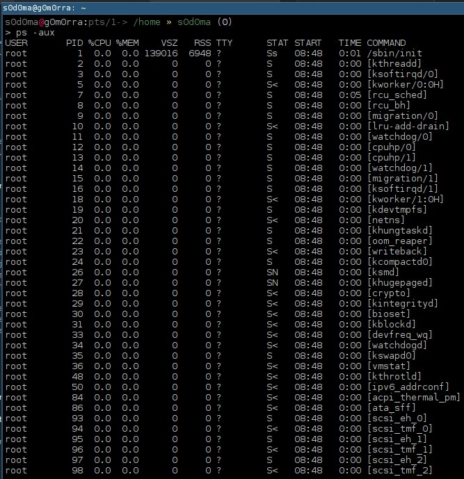

# Sistemas Operativos

Para iniciar con una definicio del sistema operativo cabe resaltar cuales son los actores que interactuan dentro de un sistema informatico:

* **Hardware** (Procesador, memoria, dispositivos de entrada y salida de datos)
* **Software** (Aplicaciones del sistema, aplicaciones de los usuarios)
* **Personas** (Usuarios en general, Administradores, Programadores)

Un sistema operativo(SO) es el software intermediario entre el hardware y los usuarios. Es encargado de proveer un entorno para poder ejecutar programas, administrar eficientemente los recursos del computador (hardware), facilitar la interaccion con el computador, gestionar y optimizar los recursos del computador, resolver algunos conflictos, facilitar la evolucion del software y del hardware y otras (Sonara un poco redundante pero el sistema operativo se puede ver como el conjunto de software que permite que el sistema informatico sea operativo).

## Roles del sistemas operativo

### 1. Sistema operativo como interface del hardware

Al ver el sistema operativo como una interface del hardware, se pueden añadir caracteristicas no existentes en el hardware(Por ejemplo que un hardware no tenga funciones para operaciones de punto flotante, pero por mediod el sistema operativo se podria escribir estas funciones virtuales que realicen estas operaciones). Tambien permite ocultar errores que aveces ocurren en el hardware (El sistema operativo esta pendiente de los errores que ocurren en el hardware y cuando ocurre alguno, se puede capturar y realizar ciertas acciones cuando esto pase, evitando mostrar el error del hardware). Al tener el sistema operativo como una interface del hardware, nos ofrece una maquina extendida (por este concepto es posible realizar virtualizacion sobre el hardware con ayuda del software, permitiendo tomar recursos fisicos y emular algunos mecanimos faltantes para poder montar una maquina dentro de otra maquina).

El sistema operativo envuelve el hardware en una capa abstracta permitiendonos ampliar ciertas caracteristicas no presentes en el hardware y a su vez oculta algunos detalles "incomodos" del hardware.

#### Interfaces del sistema operativo

Si vemos desde el punto de vista desde usuario podremos obtener 3 interfaces o entornos de trabajo, estas interfaces o entornos de trabajo nos brinda una forma amigable de trabajo sobre el sistema operativo. Ya que dentro de este sistema informatico tenemos 3 roles a simple vista (Usuario final, Administradores, Programadores). El sistema operativo suele proporcionar utilidades basicas para que el usuario pueda desempeñar diferentes tareas, aprovechando las interfaces dadas por el sistema operativo. Por ejemplo trabajar con discos y con archivos, Ejecutar aplicaciones (cargador de programas), imprimir, administracion del sistema o usar funciones del sistema para escribir sus propias aplicaciones.

##### **Usuarios finales =** Interface de ejecucion y trabajo sencillo (GUI).

Los usuarios finales, son aquellos usuarios que no tienen conocimiento tecnico sobre el sistema operativo y su finalidad es usar el sistema operativo para el dia a dia (trabajo, ofimatica, redes sociales, etc). El aspecto que tiene esta interface es completamente grafica y lleva como nombre GUI (Graphical User Interface). La GUI de un sistema operativo es un programa informatico que actua como una interface de usuario, usando un conjunto de imagenes y objetos graficos, brindando un entorno visual sencillo para permitir la comunicacion del sistema operativo y el usuario final. (por ejemplo windows tiene el proceso explorer.exe que es el encargado de darle todo el aspecto visual a sistema operativo, si buscamos diferentes entornos graficos para linux encontramos de todas las formas y sabores).

Ejemplos de GUI

Arquitectura de la parte grafica de un sistema operativo

##### **Administradores =** Interface de administracion (CLI)

Los administradores del sistema operativo, son aquellos usuarios que tienen conocimiento tecnico de la configuracion y administracion del sistema y se necesita expandir mas la interface con la que interactuan, ya que deben acceder a los servicios del sistema. La interface de administracion se extiende a un lenguaje sencillo para dar instrucciones al sistema operativo por medio de comandos llamada CLI (Console Line Interface). Esta extension se llama shell, es una interprete de comandos del sistema que provee una interface administrativa para acceder a los servicios del sistema operativo. La mayoria de instrucciones que interpreta o se ejecutan dentro de la shell son programas ubicados dentro de ciertas carpetas del sistema (ejem: Windows -> C:/Windows/System32 o Linux -> /usr/bin ), Estos programas estan hechos especialmente para ser ejecutados via la linea de comandos.

##### **Desarrolladores =** Interface de programacion (API)

### 2. Sistema operativo como interface del hardware

Nos permite "gobernar" el hardware de manera eficiente y nos ayuda concediendo recursos de hardware de forma segura.
