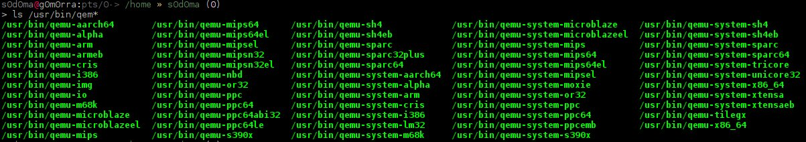
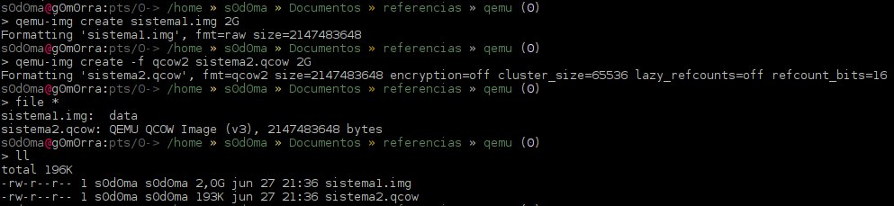
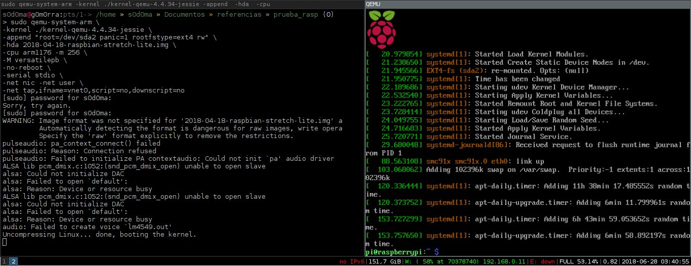

# 1. Virtualizacion(Teoria)

<p align="center">
<br>
*imagen sacada http://www.ofimaticatouza.com*
</p>

La virtualizacion es una tecnologia que permite la creacion de multiples ambientes en una sola instancia fisica.

>En términos más prácticos, imagine que tiene tres servidores físicos con propósitos dedicados individuales. Uno es un servidor de correo, otro es un servidor web y el otro ejecuta aplicaciones heredadas internas.   Se utiliza cerca del 30% de la capacidad de cada servidor, es decir, solo una parte de su potencial de ejecución. Pero como las aplicaciones heredadas siguen siendo importantes para sus operaciones internas, tiene que conservarlas junto con el tercer servidor que las hospeda, ¿cierto?.

<p align="center">

</p>

>En términos "tradicionales", la respuesta es sí. Generalmente, era más fácil y confiable ejecutar tareas individuales en servidores individuales: un servidor, un sistema operativo y una tarea. No era sencillo asignar múltiples tareas a un servidor. Pero la virtualización permite dividir el servidor de correo en dos servidores únicos que pueden administrar tareas independientes para que las aplicaciones heredadas se puedan migrar. Se utiliza el mismo hardware, pero de manera más eficiente

<p align="center">

</p>

> Si pensamos en la seguridad, es posible volver a dividir el primer servidor para que administre otra tarea, y aumentar su uso de un 30% a un 60%, y luego a un 90%. Una vez que lo logra, los servidores que quedan vacíos se pueden reutilizar para otras tareas o retirarse todos juntos para reducir los costos de refrigeración y mantenimiento.

*FUENTE :* https://www.redhat.com/es/topics/virtualization/what-is-virtualization

<p aling="justify">
Al poder tener diferentes instancias en un mismo recurso fisico, podremos configurar ambientes de trabajo ya sea para multiples instancias en diferentes recursos y intercomunicarlas entre si por reglas de ruteo y otros aspectos. Otra forma de crear las instancias para ambientes de desarrollo para diferentes arquitecturas, nos da posibilidad de realizar cross compiling (escribir codigo para diferentes arquitectuas y compilarlas desde una arquitectura completamente diferente).
</p>

<p align="center">
<br>
*https://developer.arm.com/products/architecture/a-profile/docs/100942/latest/aarch64-virtualization*
</p>


<p align="justify">
En este caso el sistema operativo es "cambiado" por un nuevo mecanismo, llamado hypervisor, es el encargado de crear, iniciar, terminar y eliminar las direntes instancias virtualizadas. por ejemplo:
</p>

1. VirtualBox
2. VMware
3. Proxmox
4. Qemu
5. http://www.hercules-390.eu/

Mas informacion: https://en.wikipedia.org/wiki/Comparison_of_platform_virtualization_software

# 3. VirtualBox

<p align="center">

</p>

## Instalacion en debian

## Creacion de maquina virtual

## Configuracion de red

## Guest Additions

# 3. Qemu

<p align="center">

</p>

<p align="justify">
Qemu es un virtualizacion y un emulador de codigo abierto. Cuando se usa como emulador de maquina, Qemu puede ejecutar sistemas operativos y programas creados para una arquitectura especifica (por ejemplo para sistemas de arquitectura de ARM), Qemu usa traduccion dinamica de arquitectura y logra un buen rendimiento.
</p>

<p align="justify">
Cuano Qemu se usa como virtualizador, Qemu logra un rendimiento casi nativo al ejecutar codigo de invitado directamente en la CPU fisica. Qemu admite la virtualizacion cuando se ejecuta bajo el hipervisor Xen o utilizando el modulo de kernel KVM en linux. Al usar KVM Qemu puede virtualizar diferentes arquitecturas (MIPS, ARM de 32 y 64, POWERPC de 64, procesadores de la familia X86 y otros).
</p>

### Instalacion

```bash
sudo apt-get install qemu
```
Para verificar su instalacion ejecutamos:

```bash
ls /usr/bin/qem*
```

<p align="justify">
y obtendremos algo como esto, estamos listando todos los ficheros que nos permitiran realizar una emulacion de diferentes arquitecturas.
</p>

<p align="center">

</p>

<p align="justify">
Para empezar con el uso de de Qemu, miraremos dos formas de almacenar nuestros sistemas emulados, tenemos el formato .img el cual nos permite tener nuestro sistema dentro de este archivo (como si tuvieramos un disco duro alli) o en el formato qcow2 que tambien nos permite almacenar nuestro sistema dentro de este archivo. una de las diferencias de estos dos formatos, es que si por ejemplo nosotros definimos que nuestro sistema va a tener 20 gb de almacenamiento interno, en el formato .img se creara un archivo de 20gb, en cambio si creamos un archivo .qcow2 para almacenar 20gb nuestro archivo solo pesara lo que se este usando en ese momento y no ocupa todo el espacio que hemos definido.
</p>

para crear una imagen de disco de estos ficheros usaremos una herramienta de qemu. Tendremos que ejecutar:

```bash
qemu-img create nuestrosistema.img 20G
```

```bash
qemu-img create -f qcow2 nuestrosistema.qcow 20G
```
<p align="justify">
Un ejemplo practico seria algo asi. primeramente creamos los dos discos con sus formatos. luego con el comando file verificamos que tipo de archivo es, y luego verificamos el tamaño de los dos archivos y vemos que uno corresponde a 2g y el otro solo tiene 193k.
</p>

<p align="center">

</p>

Para iniciar nuestro sistema ejecutamos qemu(dependiendo de la arquitectura que vayamos a usar), luego le pasamos el argumento -hda donde el siguente argumento sera el fichero (ya sea con path relativo o absoluto) donde se encuentra nuestro disco que creamos, el siguente argumento seria el -boot que le pasamos la letra b para definirle que se inicio booteando el archivo iso que le definimos, Luego viene el -cdrom donde definiremos la iso para instalar nuestro sistema y por ultimo el parametro -m donde definiremos la memoria ram que tendra nuestra maquina.

```
qemu -hda nuestrosistema.img -boot d -cdrom ./sistemaoperativo_i386.iso -m 1G
```

Despues de iniciar nuestra maquina y instalar el sistema, podremos volver a iniciar esta maquina virtual con el siguente comando

```
qemu -m 1G -hda nuestrosistema.img
```

**Ejercicio :** Emular debian con qemu.

## Raspbian en Qemu

<p align="center">

</p>

<p align="justify">
En este caso emularemos el sistema operativo por preferencia del raspberry pi, Raspbian es una version de debian para la board de hardware libre Raspberry PI, pero ¿Para que emular una raspberry PI si no tenemos acceso a la GPIO directamente?, Normalmente se hacen las emulaciones y las virtualizaciones para tareas de pruebas especificas, una de las tareas bien interesantes es escribir codigo desde una arquitectura a otra y poder tener la interface con la emulacion o con la virtualizacion y poder debuggear y encontrar errores. Qemu es muy poderoso en esto ya que nos permite debuggear codigo para diferentes arquitecturas sin tener una instancia totalmente virtual de la arquitectura del hardware.
</p>

<p align="justify">
Primeramente crearemos una carpeta donde guardaremos los archivos necesarios para realizar la emulacion del sistema operativo raspbian con el siguente comando.
</p>

```bash
mkdir raspberry-qemu && cd raspberry-qemu
```

<p align="justify">
Luego de esto nos descargaremos dos archivos fundamentales para realizar eso, el primero es el sistema operativo sin interface grafica (No lo hice con el de la GUI por que me daba algunos errores al iniciarla). El segundo archivo es el kernel donde se emulara este sistema operativo, este kernel es la base para que qemu pueda emular algunas funcionabilidades del sistema de manera facil y medianamente rapida.
</p>

```bash
wget http://director.downloads.raspberrypi.org/raspbian_lite/images/raspbian_lite-2018-04-19/2018-04-18-raspbian-stretch-lite.zip
wget https://github.com/dhruvvyas90/qemu-rpi-kernel/raw/master/kernel-qemu-4.4.34-jessie
```
*Si sale algun error diciendo que no encuentra instalado wget en el sistema solo debe hacer **sudo apt-get install wget***

<p align="justify">
Y ejecutaremos el siguente comando, donde le especificamos el kernel que usaremos (en el argumento -kernel), luego con montaremos el sistema de ficheros sobre /dev/sda2 (con el parametro append), despues definiremos la imagen de disco del sistema raspbian (con el parametro -hda), luego definiremos la cpu que usaremos y definiremos la ram que usara el sistema, le definimos que no usaremos la funcion de reboot, y otras configuracion a nivel de red.
</p>

```bash
sudo qemu-system-arm \
-kernel ./kernel-qemu-4.4.34-jessie \
-append "root=/dev/sda2 panic=1 rootfstype=ext4 rw" \
-hda 2018-04-18-raspbian-stretch-lite.img \
-cpu arm1176 -m 256 \
-M versatilepb \
-no-reboot \
-serial stdio \
-net nic -net user \
-net tap,ifname=vnet0,script=no,downscript=no
```
Algo asi seria el resultado.

<p align="center">

</p>

<p align="justify">
qemu es una herramienta muy potente, nos servira saber de la existencia y el uso de la misma para pruebas posteriores.
</p>

## Referencias
https://linux.die.net/man/1/qemu-img
https://opensourceforu.com/2011/05/quick-quide-to-qemu-setup/
https://wiki.debian.org/QEMU#Installation
https://azeria-labs.com/emulate-raspberry-pi-with-qemu/
https://blog.agchapman.com/using-qemu-to-emulate-a-raspberry-pi/
