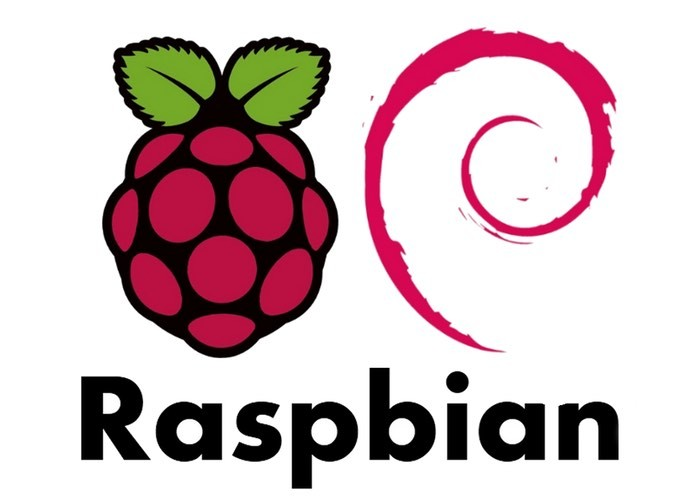

# 1. Virtualizacion(Teoria)

 
*imagen sacada http://www.ofimaticatouza.com*

La virtualizacion es una tecnologia que permite la creacion de multiples ambientes en una sola instancia fisica.

>En términos más prácticos, imagine que tiene tres servidores físicos con propósitos dedicados individuales. Uno es un servidor de correo, otro es un servidor web y el otro ejecuta aplicaciones heredadas internas.   Se utiliza cerca del 30% de la capacidad de cada servidor, es decir, solo una parte de su potencial de ejecución. Pero como las aplicaciones heredadas siguen siendo importantes para sus operaciones internas, tiene que conservarlas junto con el tercer servidor que las hospeda, ¿cierto?.

>En términos "tradicionales", la respuesta es sí. Generalmente, era más fácil y confiable ejecutar tareas individuales en servidores individuales: un servidor, un sistema operativo y una tarea. No era sencillo asignar múltiples tareas a un servidor. Pero la virtualización permite dividir el servidor de correo en dos servidores únicos que pueden administrar tareas independientes para que las aplicaciones heredadas se puedan migrar. Se utiliza el mismo hardware, pero de manera más eficiente

> Si pensamos en la seguridad, es posible volver a dividir el primer servidor para que administre otra tarea, y aumentar su uso de un 30% a un 60%, y luego a un 90%. Una vez que lo logra, los servidores que quedan vacíos se pueden reutilizar para otras tareas o retirarse todos juntos para reducir los costos de refrigeración y mantenimiento.

*FUENTE :* https://www.redhat.com/es/topics/virtualization/what-is-virtualization

Al poder tener diferentes instancias en un mismo recurso fisico, podremos configurar ambientes de trabajo ya sea para multiples instancias en diferentes recursos y intercomunicarlas entre si por reglas de ruteo y otros aspectos. Otra forma de crear las instancias para ambientes de desarrollo para diferentes arquitecturas, nos da posibilidad de realizar cross compiling (escribir codigo para diferentes arquitectuas y compilarlas desde una arquitectura completamente diferente).

 
*https://developer.arm.com/products/architecture/a-profile/docs/100942/latest/aarch64-virtualization*

En este caso el sistema operativo es "cambiado" por un nuevo mecanismo, llamado hypervisor, es el encargado de crear, iniciar, terminar y eliminar las direntes instancias virtualizadas. por ejemplo:

1. VirtualBox
2. VMware
3. Proxmox
4. Qemu
5. http://www.hercules-390.eu/

Mas informacion: https://en.wikipedia.org/wiki/Comparison_of_platform_virtualization_software

# 3. VirtualBox

## Instalacion en debian

## Creacion de maquina virtual

## Configuracion de red

## Guest Additions

# 3. Qemu

## Raspbian

## Risc OS

