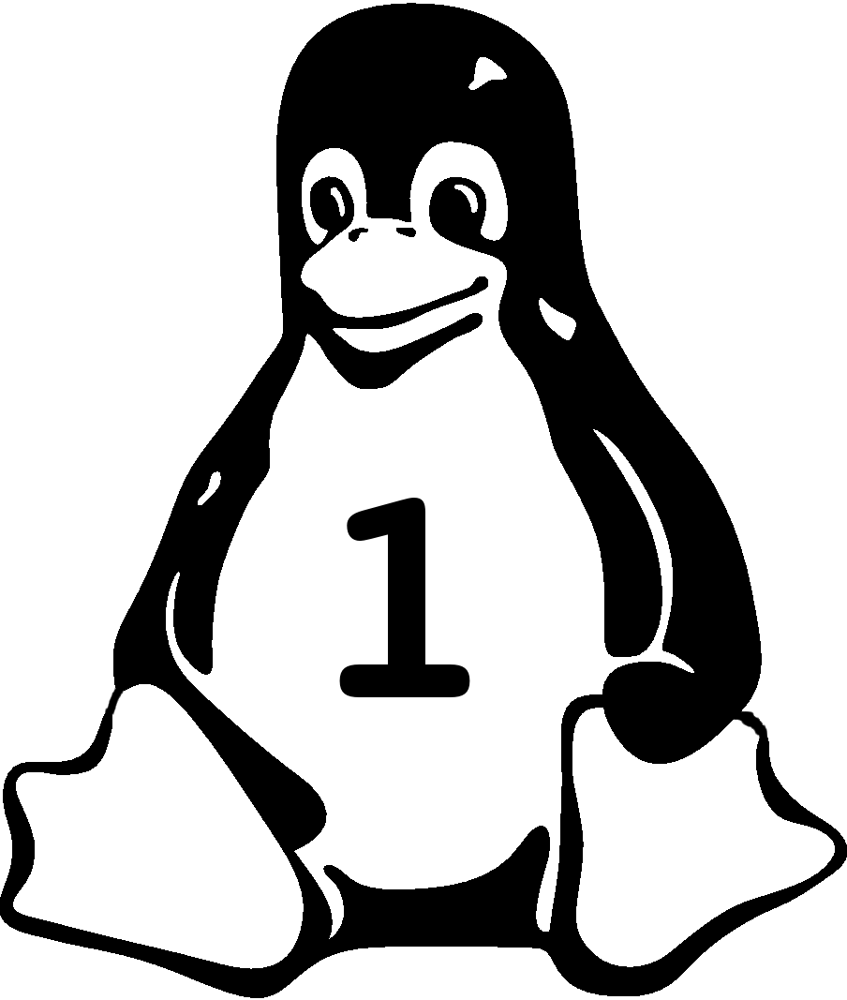

# Fase - 1 [En Construccion]

  

## Objetivo
#
La **FASE 1** tiene como objetivo principal ser el primer acercamiento del semillero **LinudecX** al sistema operativo **GNU/Linux** y a la programacion en **lenguaje C** desde este sistema operativo, donde se daran las bases teoricas y practicas para poder usar y administrar y programar el sistema operativo **GNU/Linux**. Este repositorio contendra la documentacion, los ejercicios y los laboratorios practicos *(o en su defecto forma de realizar la configuracion de los entornos)*, dando una guia para los miembros del semillero o personas externas.

## Enfoque

Muchos de los temas tratados en la **FASE 1** son basados son basados en la certificacion LPCI-1 System Administrator y en cuanto a lenguaje C sera un breve repaso de algunos de los aspectos importantes de C ,compilar programas en el sistema operativo y realizar maratones internas cada cierto tiempo.

## Comentario

Lectores si encuentran un error tanto en la descripcion tecnico de cada tema o en el plantemiento de un ejercicio o en la definicion de algun termino o ortografico o en lo que sea, agradeceriamos con toda el alma el *pull request* de la correccion, con gusto la recibiremos, Gracias.

## Temario de Linux

1. [Introduccion](README.md)
    * Primer acercamiento
        * Filosofia del software libre
        * ¿Porque usar Linux?
        * Historia
        * Reparacion Licencias
    * Sistema Operativo
    * GNU != Linux
    * Virtualizacion
    * Nociones para el uso de la terminal
2. Arquitectura del sistema
3. Instalacion de linux y administracion de paquetes
4. Commandos de linux
5. Dispositivos, sistema de archivos linux y jerarquia
6. Shell Scripting
7. Interface de usuario y escritorio
8. Tareas administrativas
9. Servicios esenciales del sistema
10. NetWorking
11. Seguridad

## Temario de Lenguaje C

1. Repaso
  * Configurando ambiente de desarrollo
    * Codeblocks
    * Atom + Pluggins
    * Vim + Some Weird Stuff
  * Tipos de datos
  * Operadores
  * Tipo de datos complejos
    * Estructuras
    * Punteros
  * Administracion de memoria
  * Manejo de archivos y streams
  * Organizando el codigo
  * Directivas del preprocesado
